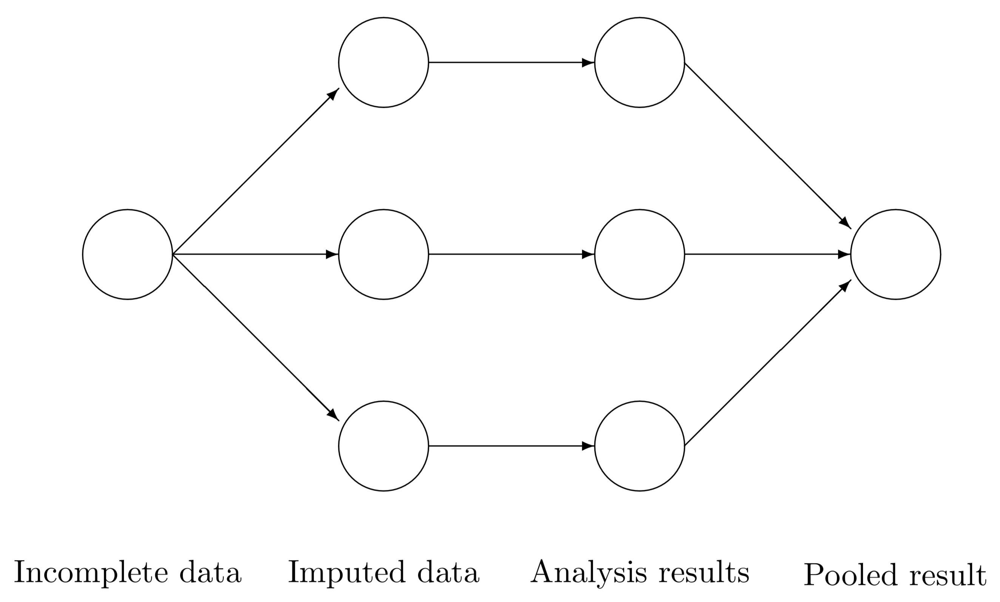

```{r setup, include=FALSE}
knitr::opts_chunk$set(echo = F, 
                      fig.pos = 'h', 
                      warning = F, 
                      out.extra = "",
                      fig.align = 'center')
```

\begin{abstract}
La Muestra Estándar Intercultural (\textquote{Standard Cross-Cultural Sample}, SCCS), compilada por Murdock y White, sirve como base de datos de información etnográfica de diversas sociedades, lo que facilita los estudios interculturales y la comprensión de la diversidad humana. 
Sin embargo, la naturaleza estática de la SCCS y los retos que plantean los datos faltantes limitan su utilidad para la investigación moderna. 
Esta tesina propone un enfoque metodológico para mejorar la SCCS mediante la creación de una encuesta dirigida basada en el conjunto de datos original. 
La metodología consiste en aplicar el Análisis de Factores Múltiples (\textquote{Multiple Factor Analysis}, MFA) para identificar las variables más significativas y elaborar un cuestionario reducido para los investigadores. Mediante la revisión manual y el aislamiento de temas, las variables se seleccionan en función de su contribución a las dimensiones del MFA. 
La encuesta resultante abarca una amplia gama de aspectos culturales, incluidos temas tradicionales de la SCCS y temas de reciente interés como los géneros no binarios y las dinámicas lingüísticas. 
La metodología propuesta pretende superar las limitaciones de la SCCS original, proporcionando una herramienta práctica para que los investigadores recojan datos etnográficos actualizados y actualicen la SCCS para análisis longitudinales y estudios comparativos. 
Esta tesina contribuye al avance de la metodología en los estudios transculturales y ofrece un valioso marco para comprender el cambio cultural y la diversidad a lo largo del tiempo.
\end{abstract}

\section{Introducción}

Los estudios transculturales desempeñan un papel crucial en la comprensión de la diversidad de las sociedades humanas y las dinámicas culturales de las distintas comunidades. 
Para ello, es fundamental disponer de conjuntos de datos exhaustivos que ofrezcan información sobre diversos aspectos culturales y faciliten el análisis comparativo. 
La Muestra Estándar Intercultural (\textquote{Standard Cross-Cultural Sample},SCCS), compilada por Peter Murdock y Douglas White [-@murdock1969standard], es uno de esos conjuntos de datos que constituye un repositorio histórico de información etnográfica de diversas sociedades de todo el mundo.

La SCCS está formada por datos de 186 sociedades bien documentadas y proporciona una valiosa información sobre una amplia gama de ámbitos culturales, como la subsistencia, la economía, la política, los rituales y las estructuras familiares. 
Sin embargo, a pesar de su importancia en la investigación transcultural, la SCCS tiene algunas limitaciones. 
Su naturaleza estática, debida a la falta de actualizaciones desde su compilación, plantea retos para los investigadores interesados en el análisis longitudinal y la comprensión del cambio cultural a lo largo del tiempo. 
Además, la dependencia del conjunto de datos de los relatos etnográficos introduce sesgos y limitaciones, lo que da lugar a información incompleta y a la frecuente ausencia de datos en la mayoría de las variables.

Para abordar estas limitaciones y liberar todo el potencial de la SCCS para la investigación transcultural contemporánea, esta tesina propone un enfoque metodológico centrado en la creación de una encuesta dirigida. 
Este enfoque se centra en aprovechar el conjunto de datos existente para desarrollar un instrumento de encuesta adaptado para captar información etnográfica actualizada de las sociedades representadas.

La metodología que aquí se propone se basa en los principios del Análisis de Factores Múltiples (\textquote{Multiple Factor Analysis},MFA), una técnica de reducción de la dimensionalidad adecuada para procesar variables categóricas. 
Mediante la aplicación del MFA al conjunto de datos original de la SCCS, esta tesina pretende identificar las variables culturales más significativas y priorizarlas para su inclusión en la encuesta dirigida. 
Mediante la revisión manual y el aislamiento de temas, se seleccionarán las variables en función de su relevancia para el discurso antropológico contemporáneo y su potencial para captar la diversidad cultural en las distintas sociedades. El resultado puede, a su vez, ser actualizado mediante este mismo método

El cuestionario de la encuesta resultante abarcará una amplia gama de aspectos culturales, incluidos los temas tradicionales tratados en la SCCS y los temas emergentes que reflejan los intereses de la antropología moderna. 
Al proporcionar a los investigadores una herramienta normalizada para la recogida de datos etnográficos actualizados, esta encuesta dirigida pretende actualizar la SCCS, permitiendo el análisis longitudinal y los estudios comparativos del cambio cultural a lo largo del tiempo.

En las secciones siguientes de esta tesina, profundizaré en la metodología propuesta, analizando el proceso de creación de la encuesta dirigida, los criterios de selección de variables y las implicaciones del diseño de la encuesta para la investigación transcultural. 
Con ello pretendo avanzar en la metodología de los estudios transculturales y contribuir a una comprensión más completa de la diversidad humana y la dinámica cultural.


\section{Estado de la cuestión}

Imaginen que los científicos de la Tierra (geólogos, biólogos, meteorólogos, etc.) hubiesen dejado de tomar fotos aéreas en los años sesentas debido a que no muestran suficiente detalle, aplanando la realidad. 
Ahora, ellos prefieren usar sólo fotografías a nivel de suelo y muestras tangibles. 
En este caso, no dudaríamos ni un minuto en decir que han perdido la perspectiva. 
Esta analogía refleja el cambio que se dio en los años sesentas a ochentas en los métodos antropológicos de monografías y bases de datos a gran escala a estudios más especializados y acotados a zonas urbanas y naciones. 
Si bien este cambio tuvo sus razones legítimas, también corría el riesgo de ignorar el gran espectro de la diversidad humana. 
La presente sección tiene como objetivo mostrar cómo llegamos aquí, los problemas que esto conlleva, y la posible solución a la que este trabajo trata de contribuir.

A finales del siglo XIX, estudiosos como Sir James Frazer y E. B. Tylor intentaron responder a preguntas sobre la evolución de los humanos. 
Para ello, compararon descripciones de la vida tribal proporcionadas por miembros de tribus occidentalizadas y misioneros. 
Este enfoque, conocido como \textquote{antropología de sillón}, fue criticado por ser demasiado ingenuo en su lectura de las fuentes y por ignorar los conflictos de intereses y la ignorancia de los autores. 
Este enfoque proyectaba prejuicios en el peor de los casos y aplanaba la realidad en el mejor. 
La tendencia a proyectar prejuicios quedó patente en la teoría del evolucionismo unilineal, que sugiere que algunas sociedades se encuentran en diferentes fases de progreso. 
El unilinealismo es un ejemplo clásico de la naturaleza altamente especulativa de esta escuela de pensamiento.

A principios del siglo XX, Bronisław Malinowski propuso que los antropólogos realizaran ellos mismos el trabajo de campo en lugar de basarse en observaciones de sillón. 
Subrayó la importancia de estudiar culturas extranjeras para evitar los prejuicios de la propia. 
Este enfoque de la investigación se conoce como etnografía.

La primera tradición etnográfica produjo documentos de alcance similar a los utilizados por los historiadores de sillón. 
Por ello, los sucesores de esta tradición no vieron ningún problema en incorporar estos documentos a sus análisis. 
El hecho de que estos documentos fueran producidos por expertos en antropología significaba que la calidad de los datos era mejor. 
Esto supuso una suspención de la crítica original sobre la calidad de las fuentes.
Mientras tanto, el análisis estadístico fue ganando popularidad lentamente a principios del siglo XX. 
Prometía eliminar la especulación, reconocida como problemática por los primeros etnógrafos. 
Con este espíritu, George Peter Murdock propuso la Muestra Etnográfica Mundial y, junto con Douglas R. White, la Muestra Transcultural Estándar (\textquote{Standard Cross-Cultural Sample}, SCCS) en 1969. 
La SCCS consiste en un conjunto cuidadosamente seleccionado de 186 culturas bien documentadas que ahora están codificadas para 1780 variables. 
En lenguaje cotidiano, la SCCS son dos cosas: la propia muestra de sociedades y la base de datos asociada a ellas.

La muestra se creó para abordar el problema de la autocorrelación filogenética, que se produce cuando las pruebas de las relaciones funcionales se ven confundidas por culturas que no son independientes entre sí. 
Esta falta de independencia puede atribuirse a que las sociedades toman prestados rasgos de culturas vecinas (influencia areal) o tienen una ascendencia común. 
Sin controlar estos problemas, es imposible atribuir las similitudes o diferencias a otras causas y establecer la independencia estadística. 
La independencia es un principio fundamental de los análisis estadísticos que incluyen mediciones de la varianza y pruebas de significatividad. 
Para resolver este problema, se pueden utilizar ajustes estadísticos que, en el mejor de los casos, pueden anular completamente los efectos de la autocorrelación. 
Otra posibilidad es eliminar la autocorrelación directamente de la muestra evitando la repetición de sociedades que se influyen mutuamente. 
Este es el enfoque que han elegido Murdock y White [@mace1994comparative]. Éste era el método disponible en la época, pero además tenía la ventaja de sencillez de implementación a escala global.

El proceso de muestreo de la SCCS puede considerarse una muestra estratificada de conveniencia. 
Murdock y White utilizaron su conocimiento de las distintas regiones para identificar 200 estratos a partir de las sociedades de las que disponían de información en su Atlas Etnográfico [@murdock1967ethnographic].
Tras seleccionar los 200 estratos, se introdujo en la muestra la sociedad mejor documentada dentro de cada estrato. 
A continuación, se estudiaron las sociedades de interés utilizando etnografías, diarios y otros materiales escritos por lugareños y misioneros. 
Estos materiales se etiquetaron línea por línea y párrafo por párrafo en función del tema. 
Se guardó una copia de referencia completa de la obra original, mientras que una segunda copia se cortó en sus líneas constituyentes. 
A continuación, se agruparon todas las líneas relacionadas con un tema concreto para codificarlas como variables en la base de datos de la SCCS.

Tras la creación de la SCCS, lo que pasó a llamarse Antropología Comparada experimentó un crecimiento y varias revistas publicaron investigaciones en este campo. 
Los académicos fueron motivados a seguir estudiando las sociedades cubiertas por la SCCS para ampliar y enriquecer la base de datos con información más detallada. 
La SCCS fue ampliamente adoptada por prestigiosas universidades, y era habitual que los departamentos de antropología albergaran una biblioteca especialmente dedicada a ella. 
En consecuencia, la base de datos creció hasta alcanzar el enorme tamaño de 1,780 variables de que disponemos hoy en día.

La respuesta de los etnólogos, sobre todo los de las escuelas Social y Cultural, no fue positiva ante la idea de que su trabajo fuera diseccionado para un análisis cuantitativo. 
Malinowski y sus seguidores criticaron ese enfoque, ya que existía la creencia de que cualquier estudio comparativo aplanaría los diferentes componentes de una sociedad. 
Además, los elementos de una cultura sólo tienen sentido como parte de un todo. 
La antropología, según Malinowski y más tarde Clifford Geertz, debía convertirse en un intento de empatizar con una cultura, de hacerse local, registrar e interpretar. 
Se consideraba científica sólo en la medida en que se basaba en la observación empírica, pero por lo demás, era hermenéutica: la rama de la filosofía que se ocupa del significado.

Estudiar a los seres humanos puede ser todo un reto porque presentan un alto grado de variabilidad a la escala espacial y temporal que nos interesa y sus respuestas a los estímulos también pueden variar mucho. 
Además, los humanos son seres complejos, e intentar modelar esta complejidad es una tarea difícil, sobre todo cuando la entidad que realiza la modelación es otro humano. 
Además, los investigadores suelen imponer a sus modelos expectativas que nunca se pedirían al modelado de objetos naturales. 
Las consideraciones éticas que conlleva la investigación con seres humanos también pueden complicar las cosas [@andreski1972social]. 
En consecuencia, las ciencias sociales han dependido históricamente más de los datos cualitativos que otros campos, lo que las hace más susceptibles a las influencias ideológicas [@dutton_philosophy_nodate].

Esta vulnerabilidad se puso de manifiesto en las décadas siguientes, cuando, en el ámbito de los círculos académicos literarios, fue creciendo lentamente un proyecto político denominado Estudios Críticos. 
En él se señalaban los problemas de parcialidad y exceso de confianza en la objetividad y la ciencia que se utilizaron para justificar políticas perjudiciales en el siglo pasado, tales como el racismo científico, que fue la base ideológica de la Segunda Guerra Mundial. 
Estas críticas eran más punzantes en el caso de las ciencias sociales, sobre todo las que se basaban en gran medida en métodos cualitativos [@latour2004has; @dutton_philosophy_nodate]. 
Esto dio lugar a una división más fuerte entre la Antropología Comparada y la Antropología Etnográfica. 
Muchos antropólogos etnográficos empezaron a cuestionar su capacidad de ser científicos y abrazaron su subjetividad, viéndose a sí mismos como escritores literarios y activistas políticos. 
A medida que aumentaba su activismo político, también lo hacía su antagonismo hacia el Estado y otras instituciones occidentales. 
Como eran la cara de la Antropología, muchos financiadores empezaron a retirarles su apoyo, lo que también afectó a la Antropología Comparada.

Otro factor que contribuye a la pérdida financiera es el cambio político y demográfico de las sociedades rurales a las urbanas. 
La urbanización ha hecho que las ciudades tengan aún más poder político y económico que en épocas anteriores. 
En consecuencia, la investigación sobre las ciudades ha recibido una mayor parte de los recursos financieros, mientras que el interés por las sociedades no industriales ha disminuido.

Del mismo modo, las etnografías cambiaron su enfoque hacia los entornos urbanos y se volvieron más especializadas. 
En lugar de registrar información cultural general, empezaron a concentrarse en aspectos no tangibles de la sociedad y dejaron de informar sobre algunos aspectos clave de las sociedades registradas. 
En consecuencia, la mayoría de las etnografías se volvieron inútiles para los antropólogos comparativos, y la proporción de datos faltantes en sus registros aumentó considerablemente. 

La antropología comparada fue más resistente a los efectos del deconstruccionismo de parte de los Estudios Críticos, ya que estaba muy formalizada. 
Sin embargo, siguió sufriendo numerosos reveses. 
Los financiadores la equipararon a la etnografía, lo que le causó daños de reputación, y perdió el acceso a fuentes de información cruciales, ya que ahora las etnografías no trataban sobre la mayoría de las sociedades y eran demasiado específicas.

Así, en los años 80 la SCCS tuvo que dejar de actualizarse por falta de fondos.
Esto supuso un reto para los investigadores, que tuvieron que decidir si 1) seguir utilizando la SCCS, 2) recurrir a otras bases de datos o 3) recopilar sus propios datos para cada pregunta de investigación. 
Aunque en principio seguir utilizando la SCCS es un buen planteamiento, tiene sus limitaciones. 
Es como basarse en fotos aéreas de los años 80 para comprender el estado actual del planeta Tierra. 
Aun así, es un buen recurso, por lo que es una suerte que en la era de Internet se pueda acceder a ésta a través de la Base de Datos de Lugares, Lengua, Cultura y Medio Ambiente (D-Place) [@kirby2016d].

El segundo enfoque se enfrenta a retos debido a las diferencias en los objetivos de las bases de datos utilizadas por los antropólogos comparativos.
Las bases de datos más utilizadas en este campo son la Encuesta Mundial de Valores (\textquote{World Value Survey}, WVS), el Estudio Comparativo de Sistemas Electorales (\textquote{Comparative Study of Electoral Systems}, CSES), las encuestas del Centro de Investigación Pew, la Encuesta Mundial Gallup, los Indicadores de Desarrollo Mundial del Banco Mundial, el Índice de Desarrollo Humano (IDH) del Programa de las Naciones Unidas para el Desarrollo y el Índice para una Vida Mejor de la OCDE. 
Estas bases de datos se derivan de diversas disciplinas como la economía, la demografía, la geografía y otras, que comparan principalmente naciones. 
Sin embargo, las naciones son un tipo específico de sociedad que posee suficiente poder industrial, económico y político para reclamar un territorio que normalmente también contiene muchas otras sociedades, y se niega a reconocerlas, ya sea a través de la persecución o redefiniéndolas como subordinadas en alguna capacidad (como reclamarlas como manifestaciones de sí misma o a través de la subyugación política). 
Por lo tanto, la comparación entre naciones muestra un sesgo a favor de las sociedades industriales y predominantemente urbanas.

El último método de recogida de datos, que consiste en recopilar éstos de forma independiente, probablemente se vea restringido por los recursos de que disponga cada investigador. 
Por lo tanto, debe ser específico y no exploratorio. 
Sólo se pueden registrar unas pocas variables antes de que resulte demasiado costoso viajar por todo el mundo.

Como diría cualquier antropólogo etnógrafo, lo que he descrito es una generalización, y todas las generalizaciones son erróneas. 
En este caso, hay dos puntos importantes que no he compartido hasta ahora. 
En primer lugar, el fin de la SCCS no significa que dejen de existir bases de datos de antropología. 
Sigue habiendo muchas bases de datos de antropología actualizadas. 
En segundo lugar, los etnógrafos no están totalmente ausentes de las sociedades no industriales ni están completamente desvinculados del compromiso con los hechos, sólo con la interpretación de estos. 

Existe un gran proyecto comparativo en curso llamado Los Archivos del Área de Relaciones Humanas (\textquote{Human Relations Area Files}, HRAF), fundado por Murdock.
HRAF es una organización sin ánimo de lucro que mantiene tres importantes bases de datos: eHRAF World Cultures, eHRAF Archaeology y HRAF Explaining Human Culture. eHRAF World Cultures es la base de datos más cercana a la SCCS y contiene sus datos originales. 
Sin embargo, se trata más bien de un corpus de etnografías completas, con variables precodificadas escasas, y no es adecuada para el análisis cuantitativo, salvo en el caso de algunas muestras. 
Además, comparte el mismo problema de los valores perdidos al que se enfrentan la SCCS y otras bases de datos que utilizan el registro etnográfico. 
eHRAF Archaeology tiene problemas similares, mientras que HRAF Explaining Human Culture es un corpus de investigaciones anteriores que tiene el potencial de permitir la síntesis de variables u observaciones utilizadas en diferentes artículos, siempre que coincidan en sus muestras.

Como vemos, existe una importante laguna que aún no se ha llenado. 
Ember y Kalodner [-@ember_status_2024, s\/p], en el HRAF, afirman que:

\begin{displayquote}
Un problema metodológico [...] es la típica división entre quienes estudian transculturalmente sociedades no industriales de menor escala y quienes utilizan países como unidades de análisis. 
Los datos para estos dos tipos de comparaciones suelen diferir: 
los datos etnográficos basados en métodos participativos proporcionan la mayor parte de la información para las sociedades no industriales; 
las comparaciones transnacionales o entre países tienden a emplear encuestas con preguntas específicas sobre unos pocos ámbitos de la vida.\footnote{Ember y Kalodner usan la siguiente referencia en este punto, pero me fue imposible acceder a ella. Independientemente de la fuente original, el punto se mantiene: Albert, Steven M., and Maria G. Cattell. 1994. “Old Age in Global Perspective: Cross-Cultural and Cross-National Views.”} 
Reunir los resultados de estos dos tipos de investigación que abarcan la gran variedad de culturas de la Tierra es todo un reto. 
\end{displayquote}


Este trabajo es una respuesta a esta afirmación, ya que pretende reunir los hallazgos de estos dos tipos de investigación, abarcando el abanico mundial de culturas.

En el mundo actual, donde la comunicación es más accesible que nunca, podemos salvar la distancia entre analistas y etnógrafos realizando encuestas dirigidas para que los etnógrafos las rellenen. 
Éstos están familiarizados con el vocabulario de la antropología y tienen la experiencia necesaria para recuperar los datos que faltan. 
Enviándoles una encuesta dirigida, podemos obtener datos de alta calidad que antes eran inalcanzables. 
En el pasado, la recogida de datos dependía de que los etnógrafos aportaran sus observaciones, que luego se plasmaban en bases de datos. 
Sin embargo, este método era fruto de las limitaciones técnicas de la época y se basaba en cualquier dato disponible. 
Con las encuestas dirigidas, los etnógrafos pueden ahora participar en el proceso de recogida de datos, lo que puede aliviar las preocupaciones sobre la validez ecológica de las observaciones resultantes. 
Además, aprovechar a la gente que ya está allá permite reducir el problema de la financiación.

Cabría hacerse dos preguntas teniendo en cuenta lo que he mencionado antes: ¿cómo pueden ayudar los etnógrafos cuando están en las ciudades y por qué querrían participar en este proyecto?

Si a un etnógrafo le preocupa el bienestar de la comunidad que investiga, las tendencias actuales son realmente preocupantes. 
Las sociedades no industrializadas están siendo ignoradas a un ritmo sin precedentes. 
Todos los campos, incluida la ciencia, les dan la espalda, y la mayoría de las descripciones modernas de la naturaleza humana siguen centrándose en las sociedades \textquote{WEIRD} (\textquote{Western, Educated, Industrialised, Rich, and Democratic}, occidentales, educadas, industrializadas, ricas y democráticas) [@arnett2016neglected;@henrich2010weirdest]. 
Esta tendencia afirma implícitamente que la naturaleza humana está bien representada por estos individuos tan particulares y que el proceso de urbanización se ha completado, lo que conlleva que las personas no industrializadas ya no existen. 
Si esto no despoja de poder a estas últimas, no sé qué puede hacerlo.

Muchas de las preocupaciones que han llevado a los etnógrafos a mostrarse escépticos ante la ciencia y a querer distanciar los estudios sociales de ella ya no son pertinentes. 
Como ha argumentado el teórico (post)crítico francés Bruno Latour [-@latour2004has], la práctica de separar los estudios sociales de la ciencia es, en el mejor de los casos, un planteamiento anticuado que pretendía empoderar a los grupos marginados y, en el peor, un error. 
En la época posterior a la Segunda Guerra Mundial, era comprensible cuestionar la objetividad de las políticas que utilizaban la ciencia para justificar el racismo, el supremacismo, los experimentos poco éticos y las guerras. 
Sin embargo, en el clima político actual, el escepticismo hacia la ciencia se utiliza para obstaculizar los avances en la lucha contra el cambio climático, la aplicación de vacunas y la promoción de los derechos de los grupos marginados, incluidas las sociedades no industriales. \footnote{Véase, por ejemplo, el rechazo a la investigación sobre los efectos de la intervención médica en individuos transgénero, negándoles servicios de salud, o en el contexto que nos atañe, la insistencia en atribuir el origen de ciertas enfermedades a grupos étnicos concretos: SIDA/VIH en comunidades nativas africanas, COVID/SARS-COV2 en China.}
En mi opinión, distanciar los estudios sociales de la ciencia siempre fue un error. 
Al fin y al cabo, si construyes castillos en el cielo, acabarán derrumbándose y cayendo sobre tu cabeza.

Una de las razones por las que este planteamiento funcionó es que es cierto que la objetividad no existe. 
Esto se debe a que las categorías siempre están implicadas en cualquier afirmación, y tenemos que imponerlas ya que no se encuentran en el mundo real.
Nosotros decidimos dónde trazar la linde en función de su utilidad, y la utilidad viene determinada por lo que consideramos importante. 
Así pues, los valores y la subjetividad están siempre presentes. 
Pregunte a cualquier estadístico sensato y le dirá que trabaja con umbrales que no están justificados por el rigor matemático, sino por el consenso. 
Sin embargo, ese mismo estadístico le dirá que la estadística proporciona una forma de organizar los hechos y dar a éstos un lugar en la mesa a la hora de tomar decisiones. 
La objetividad puede ser imaginaria, pero sigue siendo un buen ideal al que aspirar porque evita los peores efectos de la subjetividad, como la arbitrariedad, la falta de fundamento y la incapacidad de comunicar. Su esposamiento dogmático, en cambio, es ciego a la realidad de su inexistencia y conlleva los horrores que los Estudios Críticos rechazaron. La solución tal vez no es descartar este ideal imaginario, sino ser conscientes de que, como todo ideal, es imaginario y pensar concienzudamente a dónde nos está llevando y cuándo es pertinente.

Sugiero que las sociedades no industriales reciban el mismo nivel de consideración que sus homólogas industriales a la hora de debatir la diversidad humana. 
Además, propongo que se incluya a etnógrafos en los debates para que aporten su visión de las categorías, la aplicabilidad y los matices dentro de un entorno estructurado. 
¿Simplificará este enfoque en exceso la realidad y los matices de las comunidades implicadas? 
Sí, lo hará. 
¿Pasará por alto aspectos cruciales? 
Sin duda. 
¿Será parcial? 
Sí, lo será. 
Sin embargo, cuando se critican las fotos aéreas por las mismas razones, no dejamos de utilizarlas. 
En su lugar, tomamos fotos desde ángulos diferentes o utilizamos resoluciones más altas. Incluso utilizamos lentes infrarrojos para ver más allá de las copas de los árboles, los tejados y el interior de los túneles. 
Si estos métodos siguen sin ser adecuados, tal vez la herramienta en sí no sea la adecuada para la tarea que tenemos entre manos. 
Y no pasa nada. 
Cada pieza forma parte del rompecabezas, y ninguna de ellas será suficiente por sí sola. 
Pero la belleza de las fotos aéreas es que nos ofrecen una perspectiva única.

En nuestro esfuerzo por comprender la diversidad humana, es fundamental tener la perspectiva adecuada. 
Aunque los etnógrafos conocen bien sus respectivos lugares, tener un marco de referencia es igualmente importante. 
La globalización y la modernización se han convertido en el nombre del juego.
Puede que sepamos lo que se trae entre manos nuestro jugador, pero es igualmente esencial conocer el terreno, saber quién se ha modernizado y en qué momento, dónde ha mostrado resistencia y quién se ha desviado del guión tradicional. 
Pero sobre todo, cuál es ese guión.
Éste no ha sido únicamente escrito por una élite que dicta los destinos de la gente, sino por ella misma, en los caminos y patrones comunes que éstas forman.
Para obtener este conocimiento, necesitamos tener una visión a vista de pájaro de la situación que nos deje ver el \textit{ecosistema humano}.

Esperando que los argumentos anteriores basten para convencer al etnógrafo escéptico, los próximos capítulos tratarán de los criterios de diseño de la encuesta. 
Esto incluye el análisis de los datos originales de la SCCS para identificar patrones que puedan ayudarnos a resumirlos a un tamaño manejable. 
Al hacerlo, se representará la distribución de probabilidad conjunta, lo que a su vez identificará aquello que caracteriza a las sociedades de la muestra.

\section{Metodología}

En esta sección se expone el enfoque metodológico utilizado para resumir la Muestra Transcultural Estándar (SCCS) mediante la creación de una encuesta dirigida para el análisis longitudinal. 
En principio, el problema consiste en identificar qué variables son importantes para describir una sociedad a grandes rasgos. 
Esto, en estadística, se resume a una selección de variables. 
Existen varios métodos para ello, pero por razones que  veremos más adelante, en este caso usaré un método de reducción de dimensiones.
En específico, utilizaré el Análisis de Factores Múltiples (MFA).
Sin embargo, este método requiere una base de datos completa: sin datos faltantes.
Dado que no tenemos una base completa, es necesario darle la vuelta al asunto.
Así, antes de aplicar el MFA, buscaré tratar los datos faltantes y exploraré posibles métodos, mostrando que no son suficiente para nuestro caso.
Ante ello, propondré un nuevo método: el Método de Imputación Múltiple mediante Análisis de Factores Múltiples Regularizado Iterativo (MIRIMFA).
Dado que éste es un método novedoso, será necesario mostrar su desempeño mediante simulaciones controladas que muestren que éste funciona.
Así, el flujo de trabajo será: limpieza de los datos, análisis de datos perdidos, propuesta de tratamiento de éstos con MIRIMFA y su validación, análisis de factores múltiples con la base de datos completa, selección de variables, y procederé a la siguiente sección con la formulación de dichas variables como preguntas para el formulario.

\subsection{Preparación de los datos}

```{r, include=FALSE}
# INSTALL AND LOAD PACKAGES ###############################

# Installs pacman ("package manager") if needed
if (!require("pacman")) install.packages("pacman")

# Use pacman to load add-on packages as desired
pacman::p_load(pacman, psych, rio, tidyverse, dplyr, GGally,
               ggplot2, ggthemes, ggvis, httr, lubridate,
               plotly, rmarkdown, shiny, stringr, tidyr,
               Hmisc, corrplot, viridis, RColorBrewer, bookdown,
               readr, VIM, mice, UpSetR, naniar, misty,
               ggrepel, cramer, polycor, ggmosaic, lattice,
               magrittr, purrr, pan, openxlsx, FactoMineR,
               factoextra, forcats, scales, here, fastDummies,
               rnaturalearth, rnaturalearthdata, knitr, miceRanger,
               missMDA, BiocManager, patchwork, ggtext,
               kableExtra, pracma)
if (!require("missRows")) BiocManager::install("missRows")
require(missRows)
library(MIRIMFA)
```

```{r, include=FALSE}
# LOAD DATA ################################################

set.seed(2012023)

# Specify the URL of the CSV file
url <- "https://raw.githubusercontent.com/D-PLACE/dplace-data/master/datasets/SCCS/data.csv"

# Read the CSV file from the URL
data <- read_csv(url)

# REARRANGEMENT OF DATA ####################################

# Remove columns that are not needed for analysis
data <- data %>% 
  select(soc_id, var_id, code)

# Pivot the data to wide format
data <- data %>% 
  pivot_wider(names_from = var_id, values_from = code)

# RECOGNITION OF VARIABLE TYPE #############################

# Declaration of types
url2 <- "https://raw.githubusercontent.com/D-PLACE/dplace-data/master/datasets/SCCS/variables.csv"
variables <- read_csv(url2) %>% select(id,type)
variables <- rbind(variables,list("soc_id","Categorical"))
variables$id <- as.factor(variables$id)
variables$type <- as.factor(variables$type)
# Count the number of values for each type
type_counts <- table(variables$type)

# Access counts by type
categorical_count <- type_counts["Categorical"]
continuous_count <- type_counts["Continuous"]
ordinal_count <- type_counts["Ordinal"]
rm(type_counts)

# Iterate through each column name in data
for (col_name in colnames(data)) {
  # Find the corresponding row in variables using id
  variable_row <- variables[variables$id == col_name, ]
  
  # Check the type value for the current column
  col_type <- variable_row$type
  
  # Convert column to the appropriate type
  if (col_type == "Categorical") {
    data[[col_name]] <- as.factor(data[[col_name]])
  } else if (col_type == "Ordinal") {
    data[[col_name]] <- as.ordered(data[[col_name]])
  } else if (col_type == "Continuous") {
    # No need to change anything for continuous variables
  } else {
    # Handle any other cases or error handling here
  }
}

rm(col_name)
rm(col_type)
rm(variable_row)
data <- as.data.frame(data)
row.names(data) <- data$soc_id
data <- data %>% select(-soc_id)
variables <- read_csv(url2)
group_count <- unique(variables$source)
combined_vector <- paste(variables$type, variables$source, sep = " - ")
names(combined_vector) <- variables$id
combined_vector <- combined_vector[order(combined_vector)]
data <- data[, match(names(combined_vector), colnames(data))]
# CHECKING THE RESHAPED DATA ###############################

# Check the reshaped data
summary(data)
str(data)

# CODES ####################################################

#url3 <- "https://raw.githubusercontent.com/D-PLACE/dplace-data/master/datasets/SCCS/codes.csv"
#codes <- read_csv(url3)

url4 <- "https://raw.githubusercontent.com/D-PLACE/dplace-data/master/datasets/SCCS/societies.csv"
societies <- read_csv(url4)

url5 <- "https://raw.githubusercontent.com/D-PLACE/dplace-data/master/datasets/SCCS/societies_mapping.csv"
societies_mapping <- read_csv(url5)

```

\subsection{Limpieza de datos}
El primer paso consistió en preparar el conjunto de datos original de la SCCS para el análisis. 
Se descargaron los datos de D-Place [@kirby2016d] y se organizaron para análisis.

La SCCS comprende información etnográfica de `r nrow(data)` sociedades diversas, que abarca una amplia gama de aspectos culturales. 
Sin embargo, el conjunto de datos contiene `r ncol(data)` variables, lo que plantea dificultades en cuanto a la organización y gestión de los datos. 

De las variables, `r categorical_count` son nominales, `r ordinal_count` son ordinales, y `r `continuous_count` son continuas. 
Dada la forma en que se recolectaron los datos, podemos decir que las variables están agrupadas por fuentes. 
También podríamos pensar en agruparlas por categoría, pero las categorías están razonablemente alineadas con las fuentes y dada la estructura de datos faltantes de la que hablaremos más tarde, tiene más sentido agruparlas por fuente. 
Así, tenemos `r length(group_count)` grupos.

```{r}
rm(categorical_count)
rm(continuous_count)
rm(group_count)
rm(ordinal_count)
```

```{r}
# Identify troublemaker categorical variables
troublemakers <- names(data)[sapply(data, function(x) length(unique(x[!is.na(x)])) <= 1)]

```

Dado que cualquier análisis estadístico analiza la variabilidad de los datos, variables que sólo tengan un valor (variables constantes) son inútiles y se tienen que retirar por su falta de valor contrastivo. Así, removí las siguientes variables: "`r knitr::combine_words(troublemakers, and = " y ", oxford_comma = F)`".\footnote{Todas las glosas de las variables, así como de sus categorías se pueden consultar en https://d-place.org/parameters} Nótese que éstas son constantes cuando están presentes, pero hubo muchas ocasiones en que no lo estuvieron. Esto nos enfrenta a un problema recurrente en la base de datos que afrontamos en la siguiente subsección: Los datos faltantes.

```{r perdidadedatos, fig.cap="Patrones de pérdida de datos: Variables ordenadas en orden alfabético"}
# Remove troublemaker variables from data
combined_vector <- combined_vector[!(names(data) %in% troublemakers)]
data <- data[, !(names(data) %in% troublemakers)]
rm(troublemakers)
# Identify ordered factors and unordered categorical variables
ordered_factors <- sapply(data, function(x) is.ordered(x))

# MISSING DATA ANALYSIS ####################################

InitialMissingValues <- prop_miss(data)
missvar <- miss_var_summary(data)
misscase <- miss_case_summary(data)
max_pct_miss_var <- missvar %>%
  filter(pct_miss == max(pct_miss)) %>%
  select(variable, pct_miss)
min_pct_miss_var <- missvar %>%
  filter(pct_miss == min(pct_miss)) %>%
  select(variable, pct_miss)
max_pct_miss_case <- misscase %>%
  filter(pct_miss == max(pct_miss)) %>%
  select(case, pct_miss)
min_pct_miss_case <- misscase %>%
  filter(pct_miss == min(pct_miss)) %>%
  select(case, pct_miss)


vis_miss(data) + 
  theme_minimal() + 
  theme(axis.text.x = element_blank()) +
  labs(y = "Sociedades")

```


\subsection{Análisis de datos faltantes}

De los `r ncol(data)` [variables] $\times$ `r nrow(data)` [sociedades] = `r ncol(data)*nrow(data)` datos que quedan luego de retirar las variables que sólo tenían un valor, tenemos que el `r round(InitialMissingValues,4)*100`\% son datos faltantes. 
Éstos se distribuyen en todas las sociedades, ya que la cantidad mínima de datos faltantes por sociedad es de `r round(as.numeric(min_pct_miss_case[2]),2)`\%, que corresponde a la sociedad `r rownames(data)[as.numeric(min_pct_miss_case[1])]`, los `r as.character(societies[which(societies[,"id"]==rownames(data)[as.numeric(min_pct_miss_case[1])]),"pref_name_for_society"])`. 
Todas la demás sociedades tienen muchos más datos faltantes, como los `r as.character(societies[which(societies[,"id"]==rownames(data)[as.numeric(max_pct_miss_case[1])]),"pref_name_for_society"])`, que tienen hasta un `r round(max_pct_miss_case[2],2)`\% de datos faltantes.

En cuanto a variables, tenemos que `r nrow(min_pct_miss_var)` no presentan datos faltantes mientras que "`r knitr::combine_words(as.character(head(max_pct_miss_var[[1]], 3)), and = " y ", oxford_comma = F)`" presentan hasta `r round(max(max_pct_miss_case[2]),2)`\% de datos faltantes. 

Súmese a lo anterior la lectura de la figura \@ref(fig:perdidadedatos) que muestra de izquierda a derecha las variables ordenadas alfabéticamente, y de arriba a abajo a las sociedades estudiadas y los datos faltantes para cada par variable-sociedad. 
Podemos ver que no pareciera haber un patrón general de datos faltantes entre sociedades.
Excepto por unos cuantos hilos, la gráfica pareciera ser homogénea de arriba a abajo. 
En cambio, de izquierda a derecha, en la dirección de las variables, vemos claros haces de variables con datos faltantes. 
Por lo tanto, podemos decir que el mecanismo de pérdida de los datos no es completamente al azar (\textquote{Missing completely at random}, MCAR). 
Esto, sumado a que no tenemos casos completos y la proporción de datos faltantes, me obliga a concluir que el único tratamiento adecuado es la imputación múltiple.

Los datos faltantes incluyen un nivel adicional de incertidumbre a una base de datos. 
Si los datos faltan debido a un mecanismo completamente ajeno a ellos y que afecta la probabilidad de que no se registren de forma homogénea, decimos que se perdieron completamente al azar (\textquote{Missing completely at random}, MCAR) y podemos ignorarlos, ya sea mediante descartar todos los casos incompletos, o hacer los cálculos con cada uno de los datos existentes pertinentes a ese caso. 
Sin embargo, si el mecanismo que hizo que los datos se perdiesen responde al valor de otros datos sí observados (\textquote{Missing at random}, MAR), o al verdadero valor del dato que nos falta (\textquote{Missing not at random}, MNAR), ignorar los datos faltantes suele introducir un sesgo. 
Hay muchos métodos de tratar la situación, pero la más responsable epistemológicamente es la imputación múltiple.

La imputación múltiple consiste en sustituir los datos faltantes por valores posibles hasta obtener una base de datos completa que posteriormente se analiza con métodos ordinarios. 
A diferencia de la imputación simple, que sólo hace esto una vez y que uno podría criticar como inventarse los datos, esta operación se hace múltiples veces para obtener múltiples bases de datos y análisis. 
Estos análisis se comparan para estimar el error e incertidumbre adicional que nos dieron los datos faltantes y se resumen en un análisis final global. Este procedimiento se esquematiza en la figura \@ref(fig:miflowVanBuuren).

```{r}
rm(max_pct_miss_var)
rm(min_pct_miss_var)
rm(max_pct_miss_case)
rm(min_pct_miss_case)
rm(misscase)
rm(missvar)
```

```{r miflowVanBuuren, out.width='70%', fig.align='center', fig.cap='Diagrama de flujo de la imputación múltiple (Van Buuren, 2018). Los datos incompletos (\textquote{incomplete data}) se usan para crear datos imputados (\textquote{imputed data}), que se usan para analizar los resultados (\textquote{analysis results}) y finalmente agregarlos (\textquote{pooled results}).', fig.height=500, fig.width=500}

```

La forma de determinar qué valores son posibles para cada dato faltante es compleja, ya que depende del mecanismo de pérdida de los datos, lo que se pueda deducir de la distribución original a través de los datos observados, la incertidumbre inferida por expertise de área, el tipo de variables, el poder de cómputo disponible, el rigor epistemológico que se pretenda, entre otros. 
Dado que muchas veces no es posible afirmar muchas de estas propiedades, se sugiere el uso de métodos robustos a la ruptura de sus supuestos. 
Una complicación particular a este análisis es que la mayoría de los métodos de imputación conocidos están diseñados con el fin de preservar las propiedades de las distribuciones de probabilidad condicional ya que el análisis típico incluye algún tipo de regresión de interés. 
En cambio, modelos que traten de conservar las propiedades de la distribución conjunta son raros, y más los métodos de agregación que no exijan una regresión lineal de antemano, sino que se satisfagan con la aplicación de un método de reducción de dimensiones.

Ante este panorama, los métodos propuestos por Josse y Husson [-@josse2016missMDA] podrían parecer una respuesta, ya que ellos han diseñado varios métodos de agregado para procedimientos de reducción de dimensiones, tales como el análisis de componentes principales (\textquote{Principal Components Analysis}, PCA), el análisis de correspondencias (\textquote{Correspondence Analysis},CA), o el de correspondencias múltiples (\textquote{Multiple Correspondence Analysis}, MCA), entre otros. 
Incluso tienen una propuesta para el MFA mediante regularización iterativa (RIMFA), pero su propuesta es de imputación simple, no múltiple, lo que conlleva una incapacidad de tomar en cuenta la incertidumbre de los datos, como antes se mencionó.

Felizmente, Voillet et al. [-@voillet2016handling] diseñaron un método de imputación múltiple con análisis de factores múltiples (\textquote{Multiple Imputation with Multiple Factor Analysis}, MIMFA). 
Sin embargo, este método no me sirve por dos razones: 1) remueve la posibilidad de trabajar datos mixtos y sólo opera datos numéricos, y 2) sólo puede operar con datos perdidos en forma de individuos perdidos por fuente, como se puede ver en \@ref(fig:MIMFAvoillet).

```{r MIMFAvoillet, out.width='60%', fig.align='center', fig.cap='Resumen visual del método MIMFA (Voillet et al. 2016)', label= "MIMFAvoillet"}
knitr::include_graphics(here("Script","ExternalFigures","OverviewMIMFA.png"))
```

Ante tal vacío en la literatura, no queda más que proponer una solución propia.
Por ello, propongo un nuevo método: la imputación múltiple mediante análisis de factores múltiples regularizado iterativo, que por continuar con la nomenclatura hasta la fecha, llamo MIRIMFA: \textquote{Multiple Imputation by Regularised Iterative Multiple Factor Analysis}.

En resumen, MIRIMFA consta en aplicar el método de análisis de factores múltiples regularizado iterativo (\textquote{Regularised Iterative Multiple Factor Analysis imputation}, RIMFA) [@josse2016missMDA] en múltiples ocasiones, ya que éste puede manejar cualquier forma de los datos faltantes, así como datos mixtos, y luego aplicar un Análisis Conjunto de Cuadros - Estructuración de Cuadros en Tres Índices del Estadístico (\textquote{Analyse Conjointe de tableaux - Structuration des Tableaux à Trois Indices de la Statistique}, ACT-STATIS) [@lavit1994act] a las tablas disyuntivas resultantes para encontrar un espacio compromiso que permita hacerlas comparables. 
Finalmente, transforma la tabla disyuntiva de vuelta a una tabla de datos originales ya imputados. 
Así, MIRIMFA es un híbrido entre las propuestas de Josse & Husson y Voillet et al.: RIMFA y MIMFA.
En esta sección exploraremos las base matemáticas de MIRIMFA y en la siguiente sección mostraremos la validez del método con una simulación evidencie empíricamente sus propiedades aplicarlo en el problema principal: la SCCS. Para el lector interesado en usar o validar el método por su cuenta, anexo en el repositorio de GitHub un paquete de R [@r_core_team_r_2018] que permita correr MIRIMFA. 

\subsection{Bases Matemáticas de MIRIMFA}

Para entender las bases de MIRIMFA, primero tenemos que entender las bases del análisis de factores múltiples (MFA), de la imputación mediante análisis de factores múltiples regularizado iterative (RIMFA) y del análisis conjunto de cuadros - estructuración de cuadros en tres índices del estadístico (ACT-STATIS).

\subsubsection{Resumen del Análisis de Factores Múltiples}

Para mostrar la aplicabilidad del análisis de factores múltiples (MFA) a la SCCS, presento las ecuaciones principales y los principios que definen al MFA, mostrando a su vez cómo estas ecuaciones manejan tipos de variables mixtos agrupados en distintos grupos de variables.

Sea $\bm{X}$ la matriz de datos completos compuesta de $K$ subtablas $\bm{X}_{(k)}$, representando diferentes grupos de variables medidas sobre el mismo conjunto de $I$ observaciones. 
Las variables en cada una de estas subtablas pueden ser de cualquier tipo, incluyendo tanto variables continuas como categóricas [@pages2004multiple;@abdi2013multiple]:

$$
\bm{X} = \left[ \bm{X}_{(1)} \middle| \cdots \middle| \bm{X}_{(k)} \middle| \cdots \middle| \bm{X}_{(K)} \right]
$$
donde $\bm{X}_{(k)}$ es una matriz $I \times J_{(k)}$ con $I$ observaciones y $J_{(k)}$ variables en el $k$-ésimo grupo.

El proceso comienza mediante la estandarización de los datos en cada grupo para asegurar la comparabilidad entre los diferentes tipos de variable. 
Para variables categóricas, esto incluye su transformación en un conjunto de variables ficticias binarias.

Cada variable ficticia es ponderada por el inverso de la raíz cuadrada de la frecuencia relativa de la categoría:
$$
w_j=\frac{1}{\sqrt{p_q}}
$$

donde $p_q$ es la proporción de individuos en la categoría $q$.

Para prevenir que algún grupo domine el análisis, el MFA equilibra la contribución de cada grupo mediante la ponderación de cada uno de acuerdo con el primer eigenvalor ($\lambda_1$) obtenido de un análisis de componentes principales (PCA) aplicado a cada grupo:
$$
\bm{W}_k=\frac{1}{\sqrt{\lambda_1^k}}
$$
donde $\lambda_1^k$ es el primer eigenvalor de la matriz de covarianzas del grupo $k$.
Así, al concatenar las matrices estandarizadas y ponderadas, tenemos que $\bm{X}$ se convierte en $\bm{Z}$:

$$
\bm{Z} = \left[ \bm{Z}_1 \bm{W}_1 \middle| \cdots \middle| \bm{Z}_K \bm{W}_K \right]
$$
donde $\bm{Z}_k$ representa la matriz estandarizada de datos del grupo $k$ y $\bm{W}_k$ su ponderación. Al final, diremos que el número de columnas de $\bm{Z}$ es $R$ el total de todas las variables, continuas o ficticias y el número de renglones es $I$.

Para concluir el MFA, a $Z$ se le efectúa un PCA final, que provee un conjunto de componentes principales que representan la estructura subyacente de la base de datos completa, tomando en cuenta las contribuciones de cada grupo de variables.

\subsubsection{El enfoque de la Imputación Múltiple mediante el Análisis de Factores Múltiples Iterativo Regularizado (MIRIMFA)}

Para tratar tablas con variables agrupadas y datos faltantes, propongo el método MIRIMFA, una imputación múltiple adaptada al marco del Análisis de Factores Múltiples para datos mixtos. El objetivo del método no es obtener las mejores estimaciones posibles de los valores que faltan, sino sustituirlos por valores plausibles para proporcionar estimaciones de las configuraciones del MFA. De acuerdo con la metodología de la Imputación Múltiple, el enfoque MIRIMFA se lleva a cabo realizando los tres pasos siguientes:
\begin{enumerate}
  \item Imputación: generar $N$ conjuntos de datos imputados diferentes $\bm{Z}^{[1]},\ldots,\bm{Z}^{[n]}, \ldots,\bm{Z}^{[N]}$ de $\bm{X}$.
  \item Análisis mediante MFA: realizar un MFA en cada conjunto de datos imputados $\bm{Z}^{[n]}$ que dé lugar a $N$ configuraciones diferentes $\bm{F}^{[1]},\ldots,\bm{F}^{[n]}, \ldots,\bm{F}^{[N]}$.
  \item Combinación: encontrar una configuración de consenso entre todas las configuraciones $\bm{F}^{[1]}, \ldots,\bm{F}^{[N]}$.
\end{enumerate}
Estos pasos se describen detalladamente en las secciones siguientes.

\subsubsection{Generación de los datos imputados: imputación mediante Análisis de Factores Múltiples Iterativo Regularizado (RIMFA)}

El MFA es un método muy útil para bases de datos completas, pero está limitado para bases con datos faltantes. [@pages2002analyse;@husson2013handling]

Éste consiste en:
\begin{enumerate}
 \item \textbf{Inicialización:} Se reemplazan los valores que faltan en el conjunto de datos $\bm{Z}$ con estimaciones iniciales. Para datos continuos, se usa cualquier valor aleatorio, para datos categóricos, para cada variable real, la suma de las estimaciones de cada categoría debe sumar uno. Sea $\bm{Z}^0$ el conjunto de datos con valores iniciales imputados.
 \item \textbf{Pasos iterativos:}
  \subitem \textbf{Paso 1:} Se construye la matriz:
    $$\bm{Y}=\bm{Z}^{(l-1)}\left(\bm{D}_\Sigma^{-1/2}\right)^{(l-1)}-\widehat{\bm{M}}^{(l-1)}$$
    donde $\bm{D}_\Sigma$ es una matriz diagonal con pesos en función del tipo de variable (continua o indicadora).
    Para las variables continuas $r$, $\bm{D}_{\Sigma r}=1$, para las variables indicadoras, $\bm{D}_{\Sigma r}=\sqrt{p_q}$ y $\bm{\widehat{M}}^l=\bm{1m^\intercal}$, donde $\bm{m}$ es el baricentro de $\bm{Z}^{(l)}$. 
    Además, se calcula la matriz de eigenvalores regularizados:
    donde $\lambda_1^k$ es el primer eigenvalor del grupo $k$ obtenido de un PCA sobre dicho grupo, y donde $\sigma^{(k)}$ es la media de los eigenvalores sobrantes.
    Se efectúa un PCA global sobre los datos ponderados $\bm{Z}^{(l-1)} \bm{\Lambda}^{(l-1)}$, obteniendo los estimados de los componentes principales ($\widehat{\bm{F}}^l$) y de los ejes principales ($\widehat{\bm{U}}^l$) y conservando $S$ dimensiones.
  \subitem \textbf{Paso 2:} Actualización de los valores que faltan utilizando la fórmula de reconstrucción:
    $$
    \widehat{\bm{Z}}^l=\left(\widehat{\bm{M}}^{(l-1)}+\widehat{\bm{F} }^l\widehat{\bm{U}}^{l\intercal}\bm{\Lambda}^{l-1}\right)\left(\bm{D}_\Sigma^{1/2}\right)^{(l-1)}
    $$
    Se declara $\widehat{\bm{Z}}^l$ como la entrada de la nueva iteración ($\widehat{\bm{Z}}^{(l-1)}$) y se repite el paso 1 y 2 hasta llegar a la convergencia.
  \item \textbf{Múltiple imputación:} Se repiten los pasos anteriores hasta tener $N$ bases datos imputadas distintas $\bm{K}^{(1)},\ldots,\bm{K^{(N)}}$. Al realizar las imputaciones de este modo, es razonable suponer que se conservan las relaciones multivariables entre variables dentro de la unidad.
\end{enumerate}

\subsubsection{Método ACT-STATIS como estrategia de combinación}

Después de tener las $N$ bases de datos imputadas, es necesario hacerlas comparables de forma que sea posible determinar un \textit{consenso}.
Dado que los resultados del MFA pueden ser similares pero rotados, reflejados o dilatados, es necesario identificar las transformaciones que harían los resultados comparables [@abdi2007statis]. 
Un método que no tome en cuenta esta posibilidad sufrirá importantes distorsiones.
Por ello, se hará uso del método ACT-STATIS.

El método ACT-STATIS (\textquote{Analyse Conjointe de tableaux - Structuration des Tableaux à Trois Indices de la Statistique}) es una generalización del PCA que se calcula de la siguiente manera:

\begin{enumerate}
  \item \textbf{Organización de los datos:} Se tienen $N$ bases de datos, cada una con $I$ observaciones y $S$ columnas. Cada una se denotará $\bm{F}^{[n]}$ para $n=1,2,\ldots,N$.
  \item \textbf{Cálculo de la matriz de productos cruzados:} Para cada tabla $\bm{F}^{[n]}$, se calcula la matriz de productos cruzados $\bm{T}^{[n]}=\bm{F}^{[n]}\bm{F}^{[n]\intercal}$. 
  \item \textbf{Matriz de cosenos entre tablas:} Se calcula la matriz $\bm{C}$ de $S\times S$ cuyo término genérico $c_{n,n'}$, o $R_V$ se define como: 
  $$
  R_V=[c_{n,n'}]=\frac{\tr{\left(\bm{T}^{[n]\intercal}\bm{T}^{[n']}\right)}}{\sqrt{\tr{\left(\bm{T}^{[n]\intercal}\bm{T}^{[n]}\right)}\times \tr{\left(\bm{T}^{[n']\intercal}\bm{T}^{[n']}\right)}}}
  $$
  \item \textbf{PCA y definición de pesos:} Se efectúa un PCA sobre $\bm{C}$ y se escalan los elementos del primer eigenvector así obtenido de forma que sus elementos sumen uno. Este vector de eigenvector escalado es el vector de pesos $\bm{\alpha}$.
  \item \textbf{Definición de espacio compromiso:} Finalmente, el espacio compromiso se define como $\bm{T}^{[+]}=\sum_{n=1}^N \alpha_n \bm{T}^{[n]}$. 
\end{enumerate}

Bases con mayores valores de $\alpha_n$ se parecen más a las demás y tendrán un peso mayor, mientras que bases de datos atípicas tendrán un peso más cercano al cero. Los componentes principales de un PCA sobre el espacio compromiso mostrarán las coordenadas de los individuos en éste.

\subsubsection{Implementación de MIRIMFA}
El algoritmo MIRIMFA se puede resumir como sigue:

\begin{enumerate}\addtocounter{enumi}{-1}
  \item Se comienza con una base de datos incompleta de datos agrupados mixtos $\bm{X}$. Se convierten las variables categóricas a variables indicadoras y se ponderan para obtener $\bm{Z}$. Se define el número de imputaciones $N$ y la dimensionalidad $S$ del espacio compromiso.
  \item Se ejecutan $N$ imputaciones mediante RIMFA de forma que las bases de datos imputadas son idénticas en datos no faltantes, pero difieren en datos faltantes.
  \item Se ejecuta un MFA con $S$ componentes sobre cada base de datos $\bm{Z}^{[n]}$ para obtener $\bm{F}^{[n]}$.
  \item Se corre un ACT-STATIS sobre el conjunto de configuraciones $\bm{F}^{[1]},\ldots,\bm{F}^{[N]}$ para obtener $\bm{T}^{[+]}$.
\end{enumerate}


Nótese que el número de dimensiones $S$ que se usa en el algoritmo tiene que ser elegido de antemano. Sin embargo, el número de dimensiones no afecta la estimación de los datos imputados y la estimación del espacio compromiso. Dado que el corazón de MIRIMFA es un PCA ponderado, las estrategias típicas para la estimación de componentes podrían se adaptadas a MIRIMFA, pero se necesitarían investigaciones posteriores para validarlas.

\subsection{Aplicación de MIRIMFA con la base de datos \textquote{Poison}}

```{r}
data (poison)
result <- MFA(poison, group=c(2,2,5,6), type=c("s","n","n","n"),
    name.group=c("desc","desc2","symptom","eat"),
    num.group.sup=1:2, graph = F)
####

total_cells <- length(as.matrix(poison))
random_rows <- sample(1:nrow(poison), round(0.2 * total_cells), replace = TRUE)
random_cols <- sample(1:ncol(poison), round(0.2 * total_cells), replace = TRUE)
poison_amp <- poison
for (i in 1:length(random_rows)) {
  poison_amp[random_rows[i], random_cols[i]] <- NA
}
```

Para demostrar las propiedades de MIRIMFA, se corrió sobre la base de datos \textquote{Poison}, que se puede obtener del paquete de R FactoMineR [@FactoMineR]. \textquote{Poison} es una base de datos obtenida de una encuesta a alumnos y personal de una escuela primaria que experimentaron intoxicación por alimentos. 
Se les preguntaron sus síntomas y qué comieron. \textquote{Poison} tiene `r nrow(poison)` individuos registrados y `r ncol(poison)` variables agrupadas en cuatro grupos: dos variables continuas de tiempo y edad, dos categóricas de sexo y condición de enfermedad, cinco de síntomas y seis de alimentos ingeridos.

La ventaja de usar MIRIMFA en \textquote{Poison} es que tiene una estructura similar a la SCCS, aunque en menor escala, además de que tenemos los datos completos, podemos amputarlos, aplicar MIRIMFA a los datos amputados y comparar el análisis del resultado con el de los datos completos. 
La estructura de datos perdidos obtenida de la imputación puede verse en las figuras \@ref(fig:poisonAmp) y \@ref(fig:poisonAmp2).

```{r poisonAmp, fig.cap='Estructura de datos perdidos en amputación de \textquote{Poison}', label="poisonAmp", out.width= '70%'}
vis_miss(poison_amp)+ theme(axis.text.x = element_text(angle = 90, vjust = 0.5, hjust=1))+labs(y="Observaciones")

```

```{r poisonAmp2, fig.cap='Estructura de datos perdidos en amputación de \textquote{Poison}', label="poisonAmp2", out.width= '70%'}
gg_miss_upset(poison_amp,mainbar.y.label = "Tamaño de la intersección", sets.x.label = "Tamaño del conjunto")
```


Al aplicársele tanto MIRIMFA (M=20) como RIMFA a \textquote{Poison}, vemos que el uso de múltiples imputaciones sí logra estabilizar el modelo mucho más cerca de los datos originales, tal como se ve en las gráficas \@ref(fig:comparVarPoison) a \@ref(fig:partialPoison).


```{r}
RIpoison<-imputeMFA(poison_amp, group=c(2,2,5,6), type=c("s","n","n","n"),ncp = 7, maxiter=1000)
RIMFAPoison<-MFA(RIpoison$completeObs, group=c(2,2,5,6), type=c("s","n","n","n"),
    name.group=c("desc","desc2","symptom","eat"),
    num.group.sup=1:2, graph = F)

MIpoison <- MIRIMFA(poison_amp, group=c(2,2,5,6), type=c("s","n","n","n"), M = 20)
MIMFAPoison <- MFA(MIpoison$res.imputeMFA, group=c(2,2,5,6), type=c("s","n","n","n"),
    name.group=c("desc","desc2","symptom","eat"),
    num.group.sup=1:2, graph = F)
```

```{r codoOrigMIRIMFARIMFA, results='hide', fig.cap='Gráficas de codo mostrando la varianza explicada por cada dimensión en un MFA aplicado a los datos originales (cyan), los datos agregados de MIRIMFA (amarillo), y los datos imputados mediante una sola aplicación de RIMFA (rojo).', label = "codoOrigMIRIMFARIMFA", eval=FALSE}
scrP1 <- fviz_screeplot(result, barfill = turbo(4)[2], barcolor = turbo(4)[2]) +
  theme_minimal() +
  theme(plot.title = element_blank()) +
  labs(x = "Dimensiones", y = "Varianza explicada (%)")+
  coord_cartesian(ylim = c(0, 27))
scrP2 <- fviz_screeplot(MIMFAPoison, barfill = turbo(4)[3], barcolor = turbo(4)[3]) + 
  theme_minimal() +
  theme(plot.title = element_blank()) +
  labs(x = "Dimensiones", y = "")+
  coord_cartesian(ylim = c(0, 27))
scrP3 <- fviz_screeplot(RIMFAPoison, barfill = turbo(4)[4], barcolor = turbo(4)[4]) + 
  theme_minimal() +
  theme(plot.title = element_blank()) +
  labs(x = "Dimensiones", y = "") +
  coord_cartesian(ylim = c(0, 27))
scrP1 + scrP2 + scrP3 +
    plot_annotation(title = "Gráficas de codo")
```

```{r comparVarPoison, fig.cap='Comparación de coordenadas de variables cualitativas en las primeras dimensiones de un MFA aplicado a los datos originales, los datos agregados de MIRIMFA, y los datos imputados mediante una sola aplicación de RIMFA.', out.width='95%'}

# Combine data from all three datasets and add labels
combined_data <- rbind(
  transform(ggplot_build(fviz_mfa_var(result, "quali.var", repel = TRUE))$data[[2]], group = "Original"),
  transform(ggplot_build(fviz_mfa_var(MIMFAPoison, "quali.var", repel = TRUE))$data[[2]], group = "MIRIMFA"),
  transform(ggplot_build(fviz_mfa_var(RIMFAPoison, "quali.var", repel = TRUE))$data[[2]], group = "RIMFA")
)

# Plot combined data with labels
overlay_plot <- ggplot(combined_data, aes(x, y, color = group, label = label)) +
  geom_point() +
  theme_minimal() +
  geom_text_repel(size = 3, hjust = 0, vjust = 0) +
  scale_color_manual(values = c("Original" = turbo(4)[2], "MIRIMFA" = turbo(4)[3], "RIMFA" = turbo(4)[4])) +
  labs(color = "Dataset")+
  labs(x = "Primera dimensión", y = "Segunda dimensión", title = "Comparación de coordenadas de variables cualitativas") + # Elimina el título de la leyenda
  theme(legend.title = element_blank())

# Display the overlay plot
print(overlay_plot)
```

```{r, results='hide', fig.cap='Comparación de coordenadas de grupos en las primeras dimensiones de un MFA aplicado a los datos originales, los datos agregados de MIRIMFA, y los datos imputados mediante una sola aplicación de RIMFA.', eval =FALSE}
combined_var_groups <- rbind(
  transform(ggplot_build(fviz_mfa_var(result, "group"))$data[[2]], group = "Original"),
  transform(ggplot_build(fviz_mfa_var(MIMFAPoison, "group"))$data[[2]], group = "MIRIMFA"),
  transform(ggplot_build(fviz_mfa_var(RIMFAPoison, "group"))$data[[2]], group = "RIMFA"))

# Plot combined data with labels
overlay_plot <- ggplot(combined_var_groups, aes(x, y, color = group, label = label)) +
  geom_point() +
  theme_minimal() +
  geom_text_repel(size = 3, hjust = 0, vjust = 0) +
  scale_color_manual(values = c("Original" = turbo(4)[2], "MIRIMFA" = turbo(4)[3], "RIMFA" = turbo(4)[4])) +
  labs(color = "Dataset")+
  labs(x = "Primera dimensión", y = "Segunda dimensión", title = NULL) + # Elimina el título de la leyenda
  theme(legend.title = element_blank())

# Display the overlay plot
print(overlay_plot)
```


```{r contribPoison, fig.cap='Contribución de los grupos a la primera (arriba) y segunda dimensión (abajo) según un MFA aplicado a los datos originales (cyan), los datos agregados de MIRIMFA (amarillo), y los datos imputados mediante una sola aplicación de RIMFA (rojo).', eval=FALSE}
# Contribution to the first dimension
contrib11 <- fviz_contrib(result, "group", axes = 1, fill = turbo(4)[2],
  color = turbo(4)[2]) + theme(plot.title = element_blank())+
  labs(x = "", y = "Contribución (%)", title = NULL)+
  coord_cartesian(ylim = c(0, 100))
contrib12 <- fviz_contrib(MIMFAPoison, "group", axes = 1, fill = turbo(4)[3],
  color = turbo(4)[3]) + theme(plot.title = element_blank())+
  labs(x = "", y = "", title = NULL)+
  coord_cartesian(ylim = c(0, 100))
contrib13 <- fviz_contrib(RIMFAPoison, "group", axes = 1, fill = turbo(4)[4],
  color = turbo(4)[4]) + theme(plot.title = element_blank())+
  labs(x = "", y = "", title = NULL)+
  coord_cartesian(ylim = c(0, 100))


# Contribution to the second dimension
contrib21 <- fviz_contrib(result, "group", axes = 2, fill = turbo(4)[2],
  color = turbo(4)[2]) + theme(plot.title = element_blank())+
  labs(x = "", y = "Contribución (%)", title = NULL)+
  coord_cartesian(ylim = c(0, 100))
contrib22 <- fviz_contrib(MIMFAPoison, "group", axes = 2, fill = turbo(4)[3],
  color = turbo(4)[3]) + theme(plot.title = element_blank())+
  labs(x = "", y = "", title = NULL)+
  coord_cartesian(ylim = c(0, 100))
contrib23 <- fviz_contrib(RIMFAPoison, "group", axes = 2, fill = turbo(4)[4],
  color = turbo(4)[4]) + theme(plot.title = element_blank())+
  labs(x = "", y = "", title = NULL)+
  coord_cartesian(ylim = c(0, 100))


(contrib11 + contrib12 + contrib13 + 
    plot_annotation(title = "Contribución de los grupos a la primera dimensión"))/(
contrib21 + contrib22 + contrib23 + 
    plot_annotation(title = "Contribución de los grupos a la segunda dimensión"))
```


```{r contribCualPoison, fig.cap='Contribución de las variables cualitativas a la primera y segunda dimensión en un MFA aplicado a los datos originales (cyan), los datos agregados de MIRIMFA (amarillo), y los datos imputados mediante una sola aplicación de RIMFA (rojo).', eval=FALSE}
contribqualivar11 <- fviz_contrib(result, 
                                  choice = "quali.var", 
                                  axes = 1, 
                                  top = 20,
                                  fill = turbo(4)[2],
                                  color = turbo(4)[2]) + 
  theme_minimal() +
  theme(plot.title = element_blank())+
  labs(x = "", y = "Contrib. (%)", title = NULL)
contribqualivar12 <- fviz_contrib(MIMFAPoison, 
                                  choice = "quali.var", 
                                  axes = 1, 
                                  top = 20,
                                  fill = turbo(4)[3],
                                  color = turbo(4)[3]) + 
  theme_minimal() +
  theme(plot.title = element_blank()) +
  labs(x = "", y = "Contrib. (%)", title = NULL)
contribqualivar13 <- fviz_contrib(RIMFAPoison, 
                                  choice = "quali.var", 
                                  axes = 1, 
                                  top = 20,
                                  fill = turbo(4)[4],
                                  color = turbo(4)[4]) + 
  theme_minimal() +
  theme(plot.title = element_blank())+
  labs(x = "", y = "Contrib. (%)", title = NULL)

(contribqualivar11 / contribqualivar12 / contribqualivar13) +
    plot_annotation(title = "Contribución de las variables cualitativas a la Dimensión 1")

contribqualivar21 <- fviz_contrib(result, 
                                  choice = "quali.var", 
                                  axes = 2, 
                                  top = 20,
                                  fill = turbo(4)[2],
                                  color = turbo(4)[2]) + 
  theme_minimal() +
  theme(plot.title = element_blank())+
  labs(x = "", y = "Contrib. (%)", title = NULL)
contribqualivar22 <- fviz_contrib(MIMFAPoison, 
                                  choice = "quali.var", 
                                  axes = 2, 
                                  top = 20,
                                  fill = turbo(4)[3],
                                  color = turbo(4)[3]) + 
  theme_minimal() +
  theme(plot.title = element_blank())+
  labs(x = "", y = "Contrib. (%)", title = NULL)
contribqualivar23 <- fviz_contrib(RIMFAPoison, 
                                  choice = "quali.var", 
                                  axes = 2, 
                                  top = 20,
                                  fill = turbo(4)[4],
                                  color = turbo(4)[4]) + 
  theme_minimal() +
  theme(plot.title = element_blank())+
  labs(x = "", y = "Contrib. (%)", title = NULL)

(contribqualivar21 / contribqualivar22 / contribqualivar23) +
    plot_annotation(title = "Contribución de las variables cualitativas a la Dimensión 2")

```

```{r partialPoison, fig.cap='Gráfica de individuos parciales según grupo para cada base de datos: original, imputada con MIRIMFA, imputada sólo con RIMFA.', out.width='95%', fig.pos='H'}
inds1 <- fviz_mfa_ind(result, partial = "all", palette = turbo(4)[3:4]) +
  theme_minimal() +
  theme(legend.position = "none") +
  labs(title = "Original") +
  coord_cartesian(xlim = c(-2, 5), ylim = c(-3, 6.5))

inds2 <- fviz_mfa_ind(MIMFAPoison, partial = "all", palette = turbo(4)[3:4]) +
  theme_minimal() +
  theme(legend.position = "none") +
  labs(title = "MIRIMFA")   +
  coord_cartesian(xlim = c(-2, 5), ylim = c(-3, 6.5))

inds3 <- fviz_mfa_ind(RIMFAPoison, partial = "all", palette = turbo(4)[3:4]) +
  theme_minimal() +
  labs(color = "Grupo", linetype = "Grupo",
       title = "RIMFA") +
  coord_cartesian(xlim = c(-2, 5), ylim = c(-3, 6.5))
(inds1 + inds2 + inds3) +
    plot_annotation(title = "Análisis de factores multiples - Individuos")
```


```{r, results='hide', eval=FALSE}
axes1 <- fviz_mfa_axes(result)
axes2 <- fviz_mfa_axes(MIMFAPoison) +
                          theme(plot.title = element_blank(),
                                legend.position = "none")
axes3 <- fviz_mfa_axes(RIMFAPoison) +
                          theme(plot.title = element_blank(),
                                legend.position = "none")
axes1
(axes2 + axes3) +
    plot_annotation(title = "Análisis de factores múltiples - Ejes parciales")
```

```{r plotVarPoison, fig.cap='Coordenadas de variables en las imputaciones con referencia al espacio compromiso.', out.width='95%'}
PlotVarPoison <- plotVarMIRIMFA(MIpoison, 
                                col = turbo(15), 
                                graph = F)
PlotVarPoison$ggp + 
  theme_minimal() +
  theme(legend.text = element_text(size = 8), 
        legend.key.height = unit(0.4, "cm"),  # Adjust the height of legend keys
        legend.key.width = unit(0.4, "cm")) +
  labs(
    shape = "Fuente",
    color = "Variables",
    x = "Dim1",
    y = "Dim2"
  )

```

Así mismo, vemos en la figura \@ref(fig:plotVarPoison) que MIRIMFA suele ajustar las coordenadas de las variables compromiso bastante cerca de las de las imputaciones individuales, aún cuando haya dispersión entre estas. 
Si la dispersión fuera demasiado grande, diríamos que la imputación no es confiable. Otra forma de identificar si la imputación es razonable, es mediante la gráfica de proyección de los factores principales (figura \@ref(fig:plotFactorPoison)). 
Si los factores de las imputaciones se alínean con los del espacio compromiso, podemos decir que la imputación es apropiada. Visualmente, esto se manifiesta como dos haces de flechas yendo en dirección de los ejes horizontal y vertical. 
Si los haces de flechas van en todas direcciones y se revuelven, entonces la imputación es incierta. Vemos en este caso que ambas gráficas muestran una cercanía considerable, por lo que podemos decir que la imputación es de calidad y la incertidumbre está bajo control.

Con lo anterior, podemos decir que MIRIMFA trabaja apropiadamente y que nos permite visualizar la incertidumbre causada por los datos perdidos. Por ello procederé a aplicarlo sobre la SCCS.

```{r plotFactorPoison, fig.cap='Proyección de los factores de las imputaciones con referencia al espacio compromiso.', out.width='95%'}
plotFactorsPoison <- plotFactorsMIRIMFA(MIpoison, title = "Proyección de los factores principales")
plotFactorsPoison
```
```{r}
rm(plotFactorsPoison)
rm(PlotVarPoison)
rm(poison)
rm(RIMFAPoison)
rm(RIpoison)
rm(MIMFAPoison)
rm(MIpoison)
rm(inds1)
rm(inds2)
rm(inds3)
rm(overlay_plot)
rm(combined_data)
rm(result)
rm(total_cells)
rm(random_rows)
rm(random_cols)
rm(poison_amp)
```
\subsection{Aplicación de MIRIMFA a la SCCS}

Para aplicar MIRIMFA en la SCCS, tenemos que solucionar un problema antes: el mecanismo de pérdida de los datos. 
Dado que los datos perdidos se deben a la falta de reporte, y los autores tienden a no reportar lo que consideran típico u ordinario para ellos, es de esperar que los datos faltantes muestren un sesgo a favor de los valores típicos en las sociedades industrializadas, que son el lugar de origen de la mayoría de los etnógrafos. 
Este comportamiento corresponde al del mecanismo de pérdida MNAR, para el cual no se suelen recomendar ni RIMFA, ni MIMFA, y por lo tanto MIRIMFA hereda este problema de ellos. 
MIRIMFA, entonces, es recomendable para bases con datos perdidos mediante MCAR o MAR.


```{r}
test <- data[data$SCCS149==5 & data$SCCS155>=4 & data$SCCS152>=4,] %>% filter_all(any_vars(!is.na(.)))
delta_socs <- societies[societies$id %in% 
                        rownames(test),"pref_name_for_society"]
```

```{r}
weight_vector <- rep(1, nrow(data))
weight_vector[data$SCCS149 == 5 & data$SCCS155 >= 4 & data$SCCS152 >= 4] <- 2
weight_vector <- weight_vector / sum(weight_vector)
```


```{r}
table_groups <- table(combined_vector)
is_continuous <- ifelse(startsWith(names(table_groups), "Continuous"), "s", "n")
```

Afortunadamente, el mecanismo de pérdida de la SCCS está sesgado hacia los valores típicos de ciertos casos o sociedades, por lo que el sesgo introducido por esta pérdida es modelable mediante mayores pesos dados a ciertas sociedades. 
Y es justo este caso el único de MNAR para el cual RIMFA está bien equipado, ya que acepta la introducción deliberada de pesos a los renglones de la matriz de observaciones. 
Esta virtud la hereda MIRIMFA por diseño.
Es por eso que, en este trabajo, he decidido darle un peso doble a las sociedades urbanizadas con dinero y escritura verdaderos (SCCS149=5, SCCS155 $\geq$ 4, SCCS152 $\geq$ 4). 
Con el criterio anterior, tenemos que las sociedades que se usarán como base para introducir este peso son las etiquetadas como "`r knitr::combine_words(as.character(delta_socs$pref_name_for_society), and = " y ", oxford_comma = F)`".

Nótese que esto puede considerarse como meter mano en el modelo y lo más apropiado sería correr un análisis de sensibilidad para ver cuánto afectan distintos pesos inducidos [@van2018flexible]. 
Desafortunadamente, ya como queda el modelo, el poder de cómputo necesario es inmenso y hacer el análisis de sensibilidad queda fuera del alcance de este trabajo. 
No tengo más remedio, pues, que asumir que la elección de pesos fue apropiada y seguir con el análisis.

Con esto fuera del camino, procedo a aplicar MIRIMFA a la SCCS. 
Dado que el porcentaje de datos perdidos es `r round(InitialMissingValues,4)*100`\%, corrí `r round(InitialMissingValues,0)*100` imputaciones, según la recomendación estándar [@van2018flexible].

```{r, eval=FALSE}
# Este código no se corrió localmente, sino en servidores externos debido al poder de cómputo requerido
start <- 0
initial_seed <- 1
manual_threshold <- 1

for (i in 1:46){
  impute_MIRIMFA_SCCS <- MIRIMFAextraimp(data,
                        group=table_groups,
                        ncp = 2,
                        type=is_continuous,
                        manual_threshold = manual_threshold,
                        row.w = weight_vector,
                        folder_path = here("imputationsRMFA"),
                        start = start,
                        initial_seed = initial_seed)
  initial_seed <- impute_MIRIMFA_SCCS$final_seed
  start <- impute_MIRIMFA_SCCS$final_index
  manual_threshold <- manual_threshold + 1
  print(paste("Already ran",i,"imputations."))
}

MIRIMFASCCS <- MIRIMFA_STATIS(data,here("imputationsRMFA"))
```

```{r, eval=FALSE}
MIRIMFASCCS <- readRDS(here("imputationsRMFA","MIRIMFASCCS.rds"))
```

```{r, eval=FALSE}
PlotDim <- plotFactorsMIRIMFA(MIRIMFASCCS) +
           labs(title = "Proyección de los factores principales")

png_file <- here("Script","ExternalFigures", "MainFactorsMIRIMFASCCS.png")

# Generate the PNG file from the plot object
png(png_file, width = 1600, height = 1200, res = 150)  
print(PlotDim)  # Print the plot to the PNG file
dev.off()  # Turn off the PNG device
```

```{r  plotFactorSCCS, fig.cap='Proyección de los primeros factores de las imputaciones de la SCCS con referencia al espacio compromiso.', out.width='95%'}
knitr::include_graphics(here("Script","ExternalFigures","MainFactorsMIRIMFASCCS.png"))
```

Primero, diagnosticaré qué tan apropiadas son las imputaciones. 
Dado el poder de cómputo requerido y la gran cantidad de variables que sobresaturarían el gráfico, no muestro la gráfica de las coordenadas de las variables de cada imputación. 
En cambio, me satisfaré con la gráfica de los primeros dos factores principales, que vemos en la figura \@ref(fig:plotFactorSCCS). 
Vemos en ésta que los dos primeros factores de las imputaciones están tan bien alineados que es prácticamente imposible distinguirlos, aunque vemos también un sesgo del espacio compromiso con respecto a ellos (el ángulo de los factores con respecto a los ejes horizontal y vertical). 
Presumiblemente este sesgo se deba a que el espacio compromiso tenga que mantener la perpendicularidad con respecto a los otros factores no graficados aquí. 
A pesar de este sesgo, doy por buena la imputación y procedo a correr el MFA final para obtener el ordenamiento de las variables.

```{r, eval=FALSE}
MIMFASCCS <- MFA(MIRIMFASCCS$res.imputeMFA,
                   group=table_groups,
                   type=is_continuous,
                   name.group=names(table_groups),
                   ncp = 96,
                   graph = F)
saveRDS(MIMFASCCS,here("imputationsRMFA","MIMFASCCS"))
```

```{r,eval=FALSE}
MIMFASCCS <- readRDS(here("imputationsRMFA","MIMFASCCS.rds"))
```

```{r, eval = FALSE}
eigenMIMFASCCS <-get_eigenvalue(MIMFASCCS)
saveRDS(eigenMIMFASCCS,here("imputationsRMFA","eigenMIMFASCCS.rds"))
```

```{r}
eigenMIMFASCCS <- readRDS(here("imputationsRMFA","eigenMIMFASCCS.rds"))

# Print or use aggregated_cos2 as needed
knitr::kable(head(eigenMIMFASCCS,10), 
             caption = "Contribuciones de las primeras diez dimensiones obtenidas del Análisis de Factores Múltiples en la SCCS.", 
             format = "markdown", 
             booktabs = TRUE,
             col.names = c("Eigenvalor","Varianza (%)","Varianza acumulada (%)")) #%>%
#  column_spec(1, width = "1cm") %>%
#  column_spec(2, width = "2cm") %>%
#  column_spec(3, width = "8cm") %>%
#  column_spec(4, width = "4cm") 

filtered <- as.data.frame(eigenMIMFASCCS)[as.data.frame(eigenMIMFASCCS)$cumulative.variance.percent > 70, ]

min_value <- min(filtered$cumulative.variance.percent)

corresponding_dim <- rownames(filtered)[which.min(filtered$cumulative.variance.percent)]
corresponding_dim <- as.numeric(gsub(paste0("^", "Dim."), "", corresponding_dim))


### Detecting elbow
second_derivative <-  gradient(diff(as.data.frame(eigenMIMFASCCS)$eigenvalue, method="central"))

# Find the index of maximum second derivative (potential elbow point)
elbow_index <- which.max(second_derivative)
```

\subsection{Análisis de Factores Múltiples}

Existen muchos métodos de selección de variables. 
Sin embargo, la mayoría de ellos trata de representar la distribución de probabilidad condicional y trata de seleccionar las variables para una regresión específica. 
Éste no es nuestro caso. Nuestra intención es simplificar la descripción de una distribución de probabilidad conjunta. 
En otras palabras, queremos representar a la humanidad como un todo (o al menos lo que se puede ver en la SCCS original) y no relaciones específicas de interés, al menos no por el momento, y encontrar la cantidad mínima de variables para dar una buena representación sin sobresimplificar de más. 
Típicamente para esto se utilizan técnicas de reducción de dimensiones.
Pero, éstas lo que hacen es crear nuevas dimensiones que uno tiene que interpretar y que son mezclas (combinaciones lineales) de las variables originales.
Esto no es una solución viable en muchos casos, como el nuestro.
Sin embargo, podemos aplicar el método de reducción y observar la contribución de cada variable al método.
Es esto lo que haremos.

De entre los métodos de reducción de dimensiones, dada la estructura mixta de los datos y que éstos están agrupados, el método ideal es el Análisis de Factores Múltiples (MFA). 
Otros métodos de selección de variables podían ser usados, desde métodos de \textit{Machine Learning}, como K-vecinos, o árboles de decisiones, hasta otros de reducción de dimensiones, como análisis de componentes principales sobre variables ficticias. 
Sin embargo, éstos no contemplaban la estructura de los datos y mediante una exploración inicial se determinó que no eran suficientemente robustos a la violación de sus supuestos, arrojando resultados sin sentido.

El Análisis de Factores Múltiples (MFA) redujo las `r ncol(data)` que nos quedaban a `r nrow(eigenMIMFASCCS)` dimensiones. 
De éstas, se necesitan `r elbow_index` para alcanzar el codo (punto donde la contribución de las dimensiones empieza a reducir rápidamente), pero eso sólo cubre el `r round(as.numeric(as.data.frame(eigenMIMFASCCS)[elbow_index,3]),2)`\% de la varianza total. 
Por lo tanto, para que realmente las dimensiones representen a la SCCS, utilicé `r corresponding_dim` dimensiones, que cubren el `r round(as.data.frame(eigenMIMFASCCS)[corresponding_dim,3],2)`\%.

```{r, eval=FALSE}
screeplotMIMFASCCS <-fviz_screeplot(MIMFASCCS, 
                                    barfill = turbo(4)[1], 
                                    ncp = corresponding_dim,
                                    barcolor = "darkgray")+
  lab(x = "Dimensiones", 
      y = "Porcentaje de varianza explicada",
      title = "Gráfica de codo del MFA aplicado al MIRIMFA de la SCCS")

png_file <- here("Script","ExternalFigures", "screeplotMIMFASCCS.png")

# Generate the PNG file from the plot object
png(png_file, width = 800, height = 600, res = 150)  
print(screeplotMIMFASCCS)  # Print the plot to the PNG file
dev.off()  # Turn off the PNG device


```

```{r screeplotSCCS, fig.cap= "Gráfica de codo del MFA aplicado al MIRIMFA de la SCCS.", out.width='95%'}
knitr::include_graphics(here("Script","ExternalFigures","screeplotMIMFASCCS.png"))
```

A pesar de que no nos interesan las dimensiones en sí, sino las contribuciones de las variables al modelo, es prudente revisar que las dimensiones tengan sentido.
Así, podemos identificar si el modelo está funcionando.
Por ello, exploraremos las primeras dos. 
Como se ve en la figura  \@ref(fig:varsSCCS), las variables fueron ordenadas en forma de \textquote{V} con respecto a las primeras dos dimensiones. 

```{r, eval = FALSE}
QualiVarMIMFASCCS <- fviz_mfa_var(MIMFASCCS,
             "quali.var",
             col.var = turbo(4)[1],
             select.var = list(cos2 = 100),
             repel = TRUE) +
               theme_minimal() +
               labs(title = "Categorías de las variables cualitativas - Análisis de Factores Múltiples")
# Set the file path where you want to save the PNG file
png_file <- here("imputationsRMFA", "QualiVarMIMFASCCS.png")

# Generate the PNG file from the plot object
png(png_file, width = 1600, height = 1200) 
print(QualiVarMIMFASCCS)  # Print the plot to the PNG file
dev.off()  # Turn off the PNG device

```

```{r varsSCCS, fig.cap= "Gráfica de variables en las primeras dimensiones del MFA sobre la SCCS", out.width='75%'}
knitr::include_graphics(here("Script","ExternalFigures","QualiVarMIMFASCCS.png"))
```

Revisando el significado de los códigos de cada una, se puede ver que el eje horizontal contrasta variables sobre complejidad social y egalitarismo de género contra patrilinearidad. 
A la izquierda tenemos variables como el alto involucramiento de los padres en la crianza de las hijas,  falta de juicios morales ante el aborto espontáneo, continuidad entre paredes y techo (típico de métodos de construcción simple), y falta de arado, irrigación e impuestos. 
En la otra mano, a la derecha tenemos presencia de estos tres últimos, burocracia, estados y estratos sociales así como tabúes menstruales afectando a la mujer, falta de contracepción, evasión de parientes del sexo opuesto, entre otros. 
Lo anterior muestra una dicotomía en el trato de género y en complejidad social.

En cambio, el eje vertical muestra categorías relacionadas con la laxitud, en la parte superior, en contraste con una alta punitividad, en la parte inferior. 
Por ejemplo, arriba vemos variables como falta de castigo al incesto, poco control a niñas, falta de infanticidio y permisividad a relaciones con parientes políticos. 
Abajo, en cambio, vemos un alto uso del sistema judicial, burocracia, mutilación de mujeres, y alto control de los hijos.
Es por esto que concluyo que esta dimensión es de la punitividad.

Podemos comprobar esto con la figura \@ref(fig:individualsSCCS), donde se clasifican las sociedades según estas mismas dimensiones y vemos que se replica la misma forma. 
Vemos también que las sociedades más complejas y patrilineales, como los rusos (SCCS54), los romanos (SCCS49) o los vascos (SCCS50) están en el cuadrante superior derecho, tal como se esperaría de la lectura de la gráfica de variables. 
En la parte inferior, notoriamente tenemos a los Ashanti o Asante (SCCS19), que son famosos por su sistema legal altamente sofisticado y punitivo. 
Finalmente, en el cuadrante superior izquierdo vemos comunidades como la Yukaghir (SCCS120), una sociedad cazadora-recolectora con poca distinción entre géneros y poca punitividad.

```{r, eval = F}
IndCos2 <- fviz_mfa_ind(MIMFASCCS, col.ind = "cos2",
             gradient.cols = cividis(3)) +
               labs(title = "Individuos - Análisis de factores múltiples")


png_file <- here("imputationsRMFA", "IndCos2.png")

# Generate the PNG file from the plot object
png(png_file, width = 1600, height = 1200, res = 150)  
print(IndCos2)  # Print the plot to the PNG file
dev.off()  # Turn off the PNG device
```

```{r individualsSCCS, fig.cap= "Gráfica de individuos en las primeras dimensiones del MFA sobre la SCCS", out.width='75%'}
knitr::include_graphics(here("Script","ExternalFigures","IndCos2.png"))
```

Vemos también en la figura  \@ref(fig:individualsSCCS) que las sociedades complejas y patriarcales son las mejores representadas por estos ejes, ya que tienen un mayor valor de coseno cuadrado, que es una medida de la calidad de representación. 
Aún así, esta calidad es pequeña (<30\%), y vemos también que la varianza explicada por estas primeras dimensiones es apenas del `r round(as.data.frame(eigenMIMFASCCS)[2,3],2)`\%.
En términos simples, esto nos muestra que el MFA considera que las dimensiones más importantes a la hora de clasificar sociedades son el patriarcado y complejidad social, y el punitivismo, pero aún así, ésto sólo explica un `r round(as.data.frame(eigenMIMFASCCS)[2,3],2)`\% de la, por llamarla así,  \textit{diversidad de las sociedades}, y para dar cuenta de al menos un 70\%, requerimos de las `r corresponding_dim` dimensiones mencionadas anteriormente.

\subsection{Selección de variables}
Con estas `r corresponding_dim` dimensiones, se sumaron las calidades de representación (cosenos cuadrados) ponderadas por la varianza explicada por sus respectivas dimensiones. 
Las sumas resultantes se tomaron como la contribución de la variable al MFA total y se ordenaron de mayor a menor. 
Las primeras 20 variables seleccionadas de esta manera se pueden ver en \@ref(tab:SelectionVarsSCCS). La lista completa se puede ver en el repositorio de GitHub en https://github.com/i5bii977/SCCSsurvey. 

```{r, eval = FALSE}
qualiVarMIMFASCCS <-get_mfa_var(MIMFASCCS, 'quali.var')$cos2
saveRDS(qualiVarMIMFASCCS,here("imputationsRMFA","qualiVarMIMFASCCS.rds"))

quantiVarMIMFASCCS <-get_mfa_var(MIMFASCCS, 'quanti.var')$cos2
saveRDS(quantiVarMIMFASCCS,here("imputationsRMFA","quantiVarMIMFASCCS.rds"))
```

```{r}
qualiVarMIMFASCCS <- readRDS(here("imputationsRMFA","qualiVarMIMFASCCS.rds"))
quantiVarMIMFASCCS <- readRDS(here("imputationsRMFA","quantiVarMIMFASCCS.rds"))
```

```{r SelectionVarsSCCS, tab.cap="Primeras variables de la SCCS seleccionadas por el MFA."}
cos2_qualidata <- as.data.frame(qualiVarMIMFASCCS)
cos2_quantidata <- as.data.frame(quantiVarMIMFASCCS)

# Extract variable names
variable_names <- sub("_.*", "", rownames(cos2_qualidata))
variance_percent <- as.data.frame(eigenMIMFASCCS)$variance.percent
names(variance_percent) <- rownames(as.data.frame(eigenMIMFASCCS))

# Add variable names as a column
cos2_qualidata$variable <- variable_names

# Aggregate quality representations by variable names
aggregated_cos2 <- cos2_qualidata %>%
  aggregate(. ~ variable, FUN=sum)
rownames(aggregated_cos2) <-aggregated_cos2$variable
aggregated_cos2 <- aggregated_cos2 %>% select(-variable)
aggregated_cos2 <- rbind(aggregated_cos2, cos2_quantidata)
variance_percent <- variance_percent[1:ncol(aggregated_cos2)]
aggregated_cos2 <- t(apply(aggregated_cos2, 1, function(x) variance_percent*x)) %>% rowSums()
aggregated_cos2 <- aggregated_cos2[order(-aggregated_cos2)]
id <- as.vector(names(aggregated_cos2))
aggregated_cos2 <- aggregated_cos2/sum(aggregated_cos2)
accum_contrib <- aggregated_cos2
for (i in 1:length(aggregated_cos2)){
  if(i != 1){
   accum_contrib[i] <- accum_contrib[i] + accum_contrib[i-1]
  }
}
title <- as.vector(variables$title[match(id, variables$id)])
category <- as.vector(variables$category[match(id, variables$id)])
selected_vars <- data.frame(id=id, 
                            title=title, 
                            category = category)
selected_vars <- subset(selected_vars, !grepl("Data Quality", category))
rownames(selected_vars) <- NULL
# Print or use aggregated_cos2 as needed
knitr::kable(head(selected_vars,15), 
             caption = "Primeras variables de la SCCS seleccionadas por el MFA.", 
             format = "markdown", 
             longtable = TRUE,
             booktabs = TRUE,
             col.names = c("Código",
                           "Título",
                           "Categoría")) %>%
  column_spec(1, width = "1.5cm") %>%
  column_spec(2, width = "5cm") %>%
  column_spec(3, width = "3cm")

```

```{r, eval = FALSE}
QualiVarMIMFASCCS <- fviz_mfa_var(MIMFASCCS,
             "quali.var",
             col.var = "blue",
             select.var = list(cos2 = 100),
             repel = TRUE)
saveRDS(QualiVarMIMFASCCS, here("Script","ExternalFigures","QualiVarMIMFASCCS.rds"))
```

Como se puede ver la selección de variables es intuitivamente correcta, ya que, en general, define aquello que uno típicamente empezaría a describir de una comunidad si la viese por primera vez. 
Nótese aún así que ciertas variables contraintuitivas fueron promovidas hasta arriba.
La principal de estas es el mayor número contado (SCCS1862), que refleja a partir de qué número la comunidad suele sólo decir que hay muchos. 
Si bien esta es una variable extraña en un principio, puede que el modelo la reconozca como representante de la complejidad del pensamiento matemático en una sociedad.
Presumiblemente eso es clave en muchos aspectos sociales y, si bien inesperado, es una perspectiva razonable.

Es aquí donde vale la pena comparar el modelo con otros más simples.
Estos arrojaron una selección de variables que difícilmente uno consideraría válida. 
Por ejemplo, en un análisis preliminar, utilicé análisis de componentes principales (PCA, por sus siglas en inglés) sobre un conjunto de variantes ficticias ( o \textit{dummies}) representando a las variables categóricas.
Si bien este método era simple y elegante, éste seleccionaba prácticamente puras variables de género.
Si bien el género es presumiblemente importante en cualquier sociedad, y se entiende que éste está relacionado de una u otra manera con muchos aspectos de una comunidad, es difícil argumentar que ésta es simplemente su sistema de género.

Para soslayar el problema anterior, procedí a usar el sistema de categorías de la SCCS y correr un PCA sobre cada conjunto de variables dentro de una misma categoría y seleccionar de 4 a 5 por categoría.
Si bien esto introdujo diversidad y aumentó la cantidad de decisiones razonables, esta diversidad era artificial y aún así introducía selecciones cuestionables.
Por ejemplo, para la economía, prácticamente sólo seleccionaba variables sobre la esclavitud, y para los rituales, este modelo únicamente consideraba a los ritos de iniciación.
Si bien estas características de las culturas son prominentes cuando están presentes, es difícil decir que la única característica digna de reportar de una economía es si es o no esclavista. 
Lo mismo con las iniciaciones.

En cambio, con el método aquí mostrado, nuestra selección es prudente: identifica la importancia de la esclavitud, al ponerla hasta arriba, pero justo al definir si ésta está presente o no, le basta, y no se obsesiona con con otros aspectos de ésta.
En su lugar, hace muchas más preguntas sobre la economía, como base de subsistencia, modo de producción, actividad dominante, etc. 
En cuanto a rituales, el MFA reconoce a los funerales como más importantes que las iniciaciones.
Lo que tiene sentido.
El género también se acota y está presente constantemente en relaciones de familia y economía, y tan es así que la primera dimensión es una mezcla entre patriarcado y complejidad social. 
Sin embargo, el método no le da un monopolio absoluto sobre la representación de las sociedades.
Finalmente, el MFA puede hacer todo esto porque también reconoce que ciertos conjuntos de variables son más prominentes que otros. 
El método \textit{ad hoc} de que cada categoría tuviese su propio análisis le daba el mismo espacio a la economía que el que le daba al chisme.
Además de que ignoraba las relaciones entre categorías.
El MFA, en cambio, dejó al chisme y otras categorías menores de lado y promovió variables que cabría esperar dado el diseño de la SCCS y las prioridades de la mayoría de la investigación antropológica.
Es por esto que considero que el método funcionó de forma satisfactoria.

Dicho lo anterior, es importante tener en claro que éste es un método de simplificación, y como tal, de pérdida de información. 
Estamos seleccionando las variables más informativas sobre una comunidad, pero aún así la diversidad original es tan grande que, al aplicar cuestionario que en la próxima sección se muestra, sólo habremos cubierto el `r round(accum_contrib[120]*100,2)`\% de la contribución de las variables que tendríamos de tener la SCCS completa. 
Por lo anterior, la información obtenida mediante este método servirá para tener un panorama general, pero no nos dará la mejor resolución que estudios específicos posteriores podrían arrojar en su momento. 
Estudios que no están en competencia, sino que ayudan a complementar para darnos más potencia analítica. 
Con las previsiones anteriores, procedo a la elaboración del cuestionario.

\subsection{Elaboración del cuestionario}

Para la elaboración del cuestionario, tomé la lista de variables seleccionadas por el MFA y leí una a una sus definiciones.
Identifiqué posibles problemas y redacté las preguntas de forma que fuese amigable con el encuestado.
Dado que la encuesta se enviará a investigadores en todo el mundo, se formuló en inglés en el servicio de Google Forms.
Además, inserté preguntas sobre temas de investigación que no se trataban en la época de Murdock y que en la antropología moderna se consideraría negligente omitir. 
A continuación explico con más detalle.

Primero identifiqué cuáles variables se podían agrupar ya que eran operacionalizaciones diferentes de un mismo concepto. 
Por ejemplo, SCCS1756 (Tamaño de la comunidad en habitantes) y SCCS1122 (Logaritmo base 10 de la población total). 
Estas variables son redundantes y sólo se formuló esa pregunta una vez.

Otras preguntas, como la profundidad de la ascendencia unilineal (SCCS1753), son difíciles de formular en una sola pregunta. 
Esta variable se refiere a cuántas generaciones atrás puede una persona típicamente identificar siguiendo una sola línea de ascendencia: matrilineal, patrilineal o mixta. 
Por lo tanto, lo más apropiado con este tipo de preguntas es dividirlas en dos o más, como en este caso que se preguntó qué tipo de ascendencia sigue una comunidad, y cuántas generaciones pueden identificar en ella.

A su vez, el MFA identificó grupos de variables que estaban muy relacionadas y eran muy repetitivas.
Por ejemplo, las variables SCCS203 a la SCCS207 son preguntas sobre el porcentaje de contribución que cada actividad de subsistencia tiene en el suministro de alimentos.
Preguntas así se agruparon en macropreguntas con subsecciones, de forma que fuesen más amigables al lector.

En otros casos, algunas variables representaban facetas diferentes de un mismo concepto que no podían verse como equivalentes. Por ejemplo, SCCS93 a SCCS96, que son variables relacionadas con la principal fuente de poder, la segunda, la tercera y la cuarta. Al estar tan relacionadas, también se agruparon en macropreguntas.

Esta selección hizo que, al final, de las 100 variables que propuse expresar en el cuestionario, se obtuvieron 97 preguntas, entre las preguntas propias y las macropreguntas. Al final, el criterio principal fue la inteligibilidad y es también por eso que el orden de las preguntas no fue el orden dado por el modelo, si no aquel que fuese más natural para el encuestado.

En la misma línea, la formulación de preguntas buscó ser lo menos recargada en tecnicismos posible ya que los encuestados difícilmente serán especialistas en todas las áreas que cubre el cuestionario. 
Si bien es esperable que puedan contestar a la mayoría con un trabajo de campo mínimo, no lo es que estén familiarizados con el vocabulario de otra rama de la antropología, por muy básico que sea.
Esto es más notorio en el caso de las preguntas de parentesco. Éstas suelen ser sobre qué tipos de parientes son agrupados con otros. 
Por ejemplo, en español agrupamos a todos los hermanos de esposos y esposos de hermanos con el mismo término \textquote{cuñado}. 
Sin embargo, sería posible agruparlos de otras maneras. 
Y eso es lo que hacen en otras comunidades.
En estudios de parentesco, se han identificado patrones típicos de agrupamiento a los que se ha bautizado con el nombre de una comunidad prominente que utilice dicho método.
Presentar y explicar todas los posibles patrones a un encuestado para luego pedirle que aplique el concepto es impráctico.
Y hacer una pregunta que enliste todas las posibles combinaciones lógicas también lo es.
Por eso, en este caso le pido al encuestado que trace en un diagrama la agrupación pertinente y le corresponderá al analista identificar el patrón para el análisis.

Una consecuencia de todo este ajuste es que algunas de las variables del nuevo cuestionario (que llamaremos \textquote{Cuestionario Transcultural Resumido para el Siglo XXI} o 21-CCCSS por sus siglas en inglés) no serán directamente comparables con las de la SCCS, sino que serán operacionalizaciones nuevas que tendrán correlación con las históricas. 
Aún así, podremos ver que muchas variables sí son equivalentes y éstas permitirán hacer estudios longitudinales sobre el cambio que las comunidades han experimentado en el siglo XXI.

Además de las variables seleccionadas por el MFA, se sumaron tres tipos más de preguntas: preguntas de control de calidad, subpreguntas de simetría y preguntas de actualización. 
Las preguntas de control de calidad son aquellas que buscan sondear la identidad del encuestado para identificar la validez de sus observaciones.
Las subpreguntas de simetría fueron aquellas que puse porque noté algún hueco en la selección de variables que posiblemente hubiera extrañado al encuestado o lo hubiese hecho sospechar sexismo o alguna discriminación grande. 
Por ejemplo, a las preguntas de inculcación de restricción sexual en niñas (SCCS333) y de agresión en niños (SCCS298) les agregué preguntas similares para el otro género.

La última gran categoría de preguntas que agregué es la de preguntas de actualización. 
Éstas consisten en preguntas relacionadas con temas que hoy en día han tomado prominencia y no se seguían en la época de Murdock y que carecen de suficiente documentación transcultural, o que son importantes para análisis lingüísticos, filogenéticos o longitudinales. 
Estos temas fueron \textquote{Géneros no binarios}, \textquote{Lenguaje} y \textquote{Aislamiento geográfico}.

Los géneros no binarios se justifican con el hecho de que, a partir de los años 80, los sistemas de género alternativos han sido un foco de estudio intenso en toda la antropología y se ha considerado uno de los pies más flojos de la investigación anterior a esta época. 
Lo podemos ver en el hecho de que la mayoría de las preguntas de la SCCS asumen un binarismo y que las preguntas que heredamos de la SCCS mantienen dichas posturas binarias, sin contemplar la posibilidad de asignaciones alternativas de tareas.
Si bien ha sido prominente el tema en últimas fechas, ésto ha sido más bien mediante monografías. A la fecha, no hay estudios sistemáticos transculturales sobre el tema [@ember_gender_2019], por lo que éste sería el primero en su tipo y una contribución crucial en este álgido tema.

En la sección de lenguaje, se pregunta si la lengua nativa sigue viva en la comunidad, lo cual es crucial para estudios filogenéticos y longitudinales, así como se pregunta por lengua de señas: un tema ignorado para la época de la SCCS.
Hay otras preguntas que podrían hacerse con respecto a la lengua, pero no son fácilmente identificables por un antropólogo y presumiblemente son recuperables de alguna gramática de alguna variante cercana de la lengua por parte de un lingüista.

Las preguntas sobre aislamiento geográfico son importantes porque en últimas fechas, con nuevas técnicas estadísticas, las hipótesis sobre la importancia de la geografía han tenido un resurgimiento notable en la investigación humana, y el aislamiento ha surgido una y otra vez como hipótesis plausible.
Sin embargo, una revisión de la literatura muestra un comportamiento contradictorio.
Por una parte, la gran mayoría de los artículos muestran que el aislamiento tiene efectos notorios en la diversidad lingüística y cultural.
Esto hasta el punto de parecer un consenso en formación [@Lee2014Oceanic;@Padilla-Iglesias2020Geographical;@Huisman2019The].
Sin embargo, las medidas típicas de aislamiento se vuelven contradictorias al aplicar métodos estadísticos rigurosos: 
mientras que la distancia entre islas sobrevive métodos de control de relaciones filogenéticas [@Lee2014Oceanic], la rugosidad del terreno y la densidad de ríos, que son las medidas típicas del aislamiento en tierra, fallan en ser significativas [@hua2019ecological].
Presumiblemente, esto se deba más a una falta de validez de estas últimas medidas y, en tierra es más pertinente hacer un seguimiento de la interacción entre comunidades [@Schreier2009Language].
Así, el añadir estas preguntas puede dar la pieza final para la conclusión de este rompecabezas, o mostrar las deficiencias de esta línea de investigación actual.

De otras posibles líneas de investigación que han surgido desde los ochentas, como los Estudios de la Ciencia, la Antropología Digital y Urbana, y la Antropología Decolonial, no me es posible ver su pertinencia a los métodos y alcances de estudio. 
Al menos no de forma directa.
En cuanto a Estudios de la Globalización, su espíritu permea todo este trabajo, mediante el potencial de estudios longitudinales con respecto a la SCCS, como mediante preguntas específicas sobre estados anteriores y posteriores, como en la sección de aislamiento geográfico y de lenguaje.
Potencialmente serían de interés otras variables de naturaleza geográfica o de migraciones y formación de nuevas identidades, pero el método de encuesta no me parece el más adecuado, sino levantamientos puntuales, o el uso de nuevas tecnologías, como el levantamiento satelital.
Además, con cómo queda el cuestionario con estas secciones, presumiblemente ya es un cuestionario bastante largo que requerirá la atención y el espacio de los encuestados como colaboradores en esta investigación.

Hablando de longitudes. Con todas las secciones, el cuestionario termina siendo de 120 preguntas. 
Afortunadamente, algunas de estas preguntas son condicionadas y, por lo tanto, la mayoría de los encuestados no tendrán que responder las 120 si estas no son pertinentes a su comunidad de investigación.
Aún así, el cuestionario exige aproximadamente una hora y media de respuesta. Esto se determinó mediante una aplicación piloto a un antropólogo local.

El resultado final de este cuestionario se puede consultar en el repositorio de Github en https://github.com/i5bii977/SCCSsurvey.

\section{Consideraciones finales}
Si bien este estudio concluye con la formación del cuestionario, es importante tomar en cuenta a quién se administrará.
El cuestionario se administrará mediante correo electrónico a investigadores que estén trabajando las comunidades originalmente marcadas en la SCCS, o en su defecto, a investigadores de sus parientes sobrevivientes más cercanos.
Una vez se tenga la respuesta de una proporción razonable de estos y su aprobación, se precederá a publicar la base de datos así obtenida.

Nótese que este estudio tendrá limitantes considerables. 
En primer lugar, simplifica considerablemente la diversidad de las comunidades, aún más que la SCCS. 
En segundo lugar, hereda los problemas de ignorancia de temas cruciales, aunque los intente corregir mediante la ampliación y añadidura de ciertas secciones. 
Tercero, pone de lado cosas que no es factible preguntar a un antropólogo general y que es más apropiado hacer mediante levantamientos directos. 

Aun con lo anterior, el 21-CCCSS sigue teniendo puntos fuertes. Primero, da un panorama global, por muy simple que éste sea.
Segundo, la corrección de los sesgos originales de la SCCS hará del 21-CCCSS el primer estudio sistemático transcultural de sistemas de género alternativos y permitirá zanjar el tema del aislamiento geográfico, además de permitir un seguimiento de la integración de las comunidades en el siglo XXI, poniendo en igualdad de condiciones tanto sociedades industrializadas como las no industrializadas.
Tercero, si bien faltará información que es mejor hacer mediante levantamientos, será más sencillo a los investigadores que hagan dichos levantamientos ir puntualmente por ellos que levantar de nuevo lo que en el 21-CCCSS se presenta, de forma que éste servirá como pie de inicio para estudios posteriores.


```{r}
write.csv2(selected_vars,here("Script","selected_vars.csv"))
```

\section{Bibliografía}

